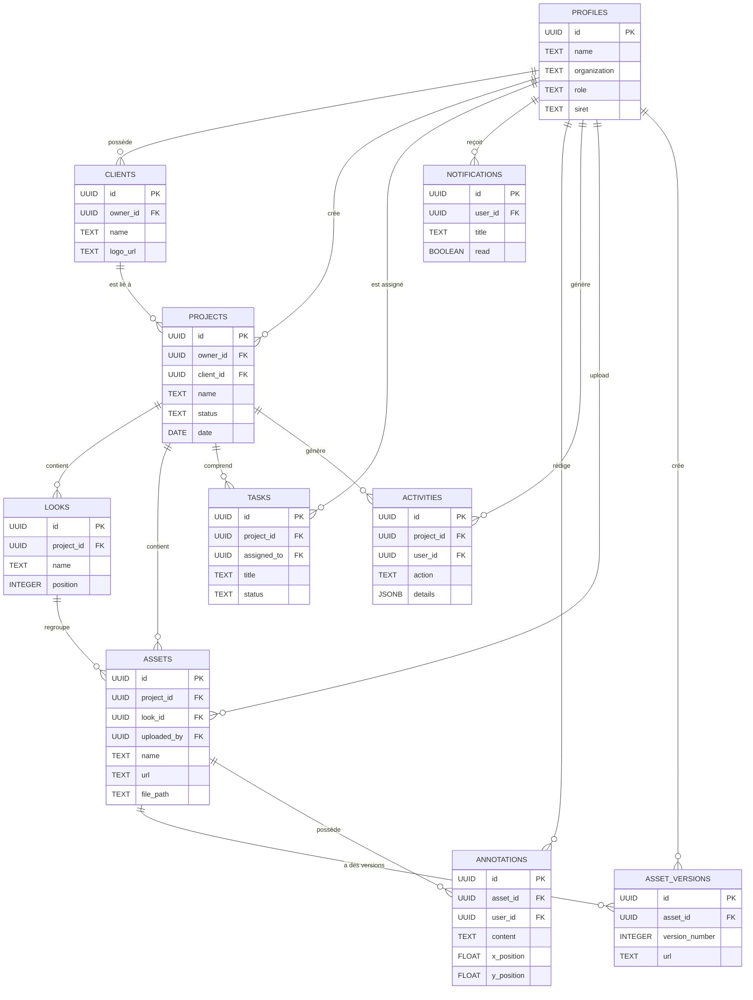
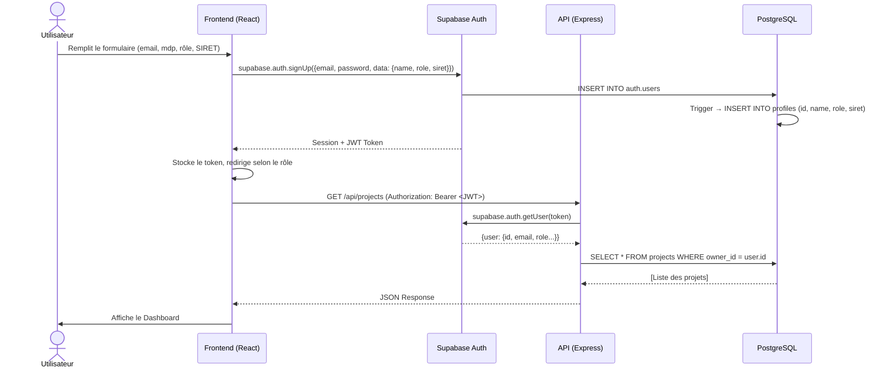
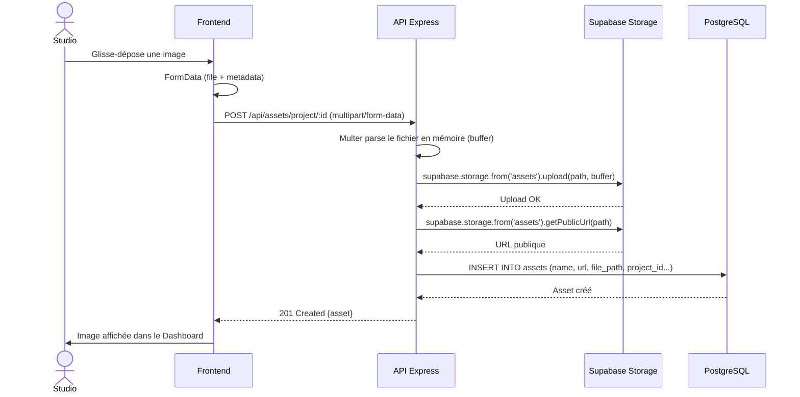
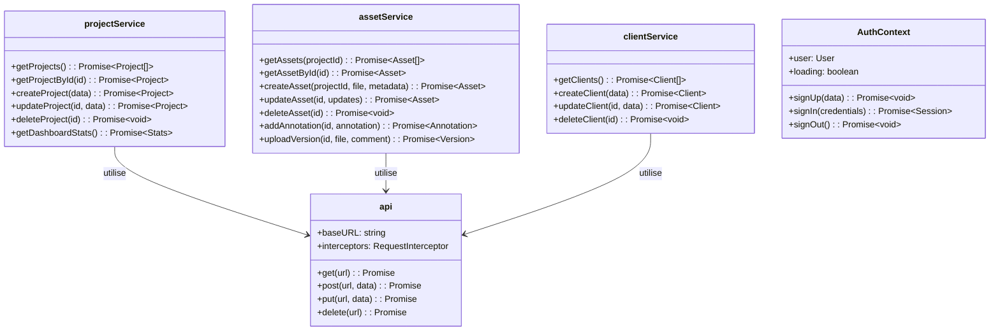
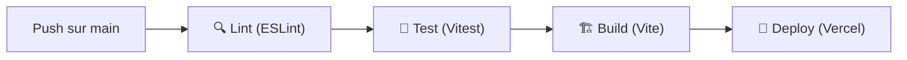
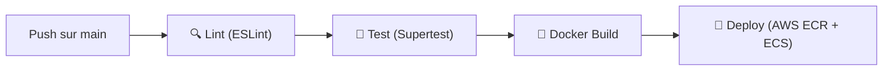

# DOSSIER TECHNIQUE — Visuals.co
## Titre RNCP 39583 — Expert en Développement Logiciel (Niveau 7)
### Bloc 2 : Concevoir et développer des applications logicielles

**Candidat :** Flavien Deroy  
**Formation :** Expert en Développement Logiciel  
**Projet :** Visuals.co — Plateforme SaaS de gestion et livraison de contenus visuels  
**Date :** Juillet 2026

---

# SOMMAIRE

1. [Introduction et Contexte](#1-introduction-et-contexte)
2. [Cahier des Charges Fonctionnel](#2-cahier-des-charges-fonctionnel)
3. [Choix Techniques et Architecturaux](#3-choix-techniques-et-architecturaux)
4. [Architecture Technique](#4-architecture-technique)
5. [Modélisation de la Base de Données](#5-modélisation-de-la-base-de-données)
6. [Diagrammes UML](#6-diagrammes-uml)
7. [Développement Frontend](#7-développement-frontend)
8. [Développement Backend](#8-développement-backend)
9. [Authentification et Sécurité](#9-authentification-et-sécurité)
10. [Gestion des Fichiers (Storage)](#10-gestion-des-fichiers-storage)
11. [Tests et Qualité](#11-tests-et-qualité)
12. [Accessibilité (RGAA / ARIA)](#12-accessibilité-rgaa--aria)
13. [CI/CD et DevOps](#13-cicd-et-devops)
14. [Documentation API (Swagger)](#14-documentation-api-swagger)
15. [Déploiement](#15-déploiement)
16. [Bilan et Perspectives](#16-bilan-et-perspectives)
17. [Annexes](#17-annexes)

---

# 1. Introduction et Contexte

## 1.1 Présentation du projet

**Visuals.co** est une plateforme SaaS (Software as a Service) conçue pour les professionnels de l'image — photographes, vidéastes, directeurs artistiques — afin de centraliser la gestion, la collaboration et la livraison de leurs contenus visuels à leurs clients.

Le marché actuel propose des solutions fragmentées : les créatifs utilisent Google Drive pour le stockage, WeTransfer pour la livraison, des tableurs pour la facturation et des messageries pour la validation. Visuals.co unifie l'ensemble de ce workflow dans une interface unique, moderne et sécurisée.

## 1.2 Problématique

> Comment concevoir et développer une application web full-stack performante, sécurisée et accessible, permettant à un professionnel de l'image de gérer l'intégralité de son cycle de production — de l'upload des médias à la livraison client — au sein d'une même plateforme ?

## 1.3 Objectifs

- Offrir un **Dashboard Studio** complet pour le professionnel (gestion de projets, clients, assets, facturation)
- Proposer un **Espace Client** dédié pour la consultation et le téléchargement des livrables
- Fournir un **Showroom immersif** permettant la présentation des visuels dans un environnement haut de gamme
- Garantir la **sécurité** des données et des fichiers (authentification JWT, RLS, CORS)
- Assurer l'**accessibilité** selon les normes RGAA/WCAG
- Mettre en place une **chaîne CI/CD** automatisée pour le déploiement continu

## 1.4 Public cible

| Rôle | Description | Accès |
|------|-------------|-------|
| **Studio** | Photographe, vidéaste, DA — le créateur de contenu | Dashboard complet, gestion projets/clients/factures |
| **Client** | Entreprise ou particulier commanditaire | Espace client, consultation, téléchargement, messagerie |

---

# 2. Cahier des Charges Fonctionnel

## 2.1 Fonctionnalités principales

### Dashboard Studio
- Tableau de bord avec KPIs (projets en cours, clients, tâches)
- Gestion CRUD des projets (création, édition, suppression)
- Gestion des clients (fiche client, logo, historique)
- Upload et organisation des assets (images, vidéos)
- Système de "Looks" (regroupement visuel des assets par séries)
- Annotations collaboratives sur les images (coordonnées x/y)
- Versioning des assets (historique des modifications)
- Génération de factures PDF (SmartInvoice via jsPDF)
- Suivi du temps (TimeTracker)
- Moodboards interactifs
- Smart Folders (dossiers intelligents avec filtres)
- Flux d'approbation (validation client)

### Espace Client
- Inscription/connexion dédiée
- Vue des projets assignés
- Téléchargement des livrables
- Messagerie intégrée avec le Studio
- Dashboard de synthèse

### Showroom
- Galerie immersive (grille + vue liste)
- Navigation plein écran
- Détail de l'image avec métadonnées EXIF
- Téléchargement individuel et en lot (ZIP)

### Fonctionnalités transversales
- Authentification double rôle (Studio / Client) avec SIRET
- Notifications en temps réel (Supabase Realtime)
- Barre de commandes rapide (Command Bar, raccourci Ctrl+K)
- Mode sombre natif
- Animations fluides (Framer Motion, GSAP)

## 2.2 Fonctionnalités exclues

- **Système de paiement en ligne** : Initialement prévu, cette fonctionnalité a été retirée du périmètre en raison de la complexité juridique liée à la conformité e-commerce (PCI-DSS, CGV, droit de rétractation). La plateforme agit désormais comme un outil de livraison, non de vente.

---

# 3. Choix Techniques et Architecturaux

## 3.1 Stack technologique

| Couche | Technologie | Version | Justification |
|--------|-------------|---------|---------------|
| **Frontend** | React | 19.2 | Bibliothèque UI déclarative, large écosystème, composants réutilisables |
| **Bundler** | Vite | 7.2 | Build ultra-rapide (ESBuild), HMR instantané, supérieur à Webpack/CRA |
| **CSS** | Tailwind CSS | 4.1 | Utility-first, productivité accrue, design system cohérent |
| **Animations** | Framer Motion / GSAP | 12.x / 3.14 | Animations déclaratives (Framer) et complexes (GSAP) |
| **Routage** | React Router | 7.13 | Routage déclaratif, layouts imbriqués, routes protégées |
| **Backend** | Express.js | 5.2 | Framework HTTP minimaliste, middleware extensible, maturité |
| **BDD** | Supabase (PostgreSQL) | — | BaaS open-source, auth intégrée, Realtime, Storage, RLS |
| **ORM/Client** | @supabase/supabase-js | 2.98 | SDK officiel, requêtes typées, gestion auth/storage unifiée |
| **Tests Front** | Vitest + React Testing Library | 3.2 / 16.3 | Compatibilité Vite native, API Jest-like, tests orientés utilisateur |
| **Tests Back** | Vitest + Supertest | 3.2 / 7.1 | Tests d'intégration HTTP, assertions sur les réponses API |
| **Tests E2E** | Playwright | — | Tests navigateur multi-plateformes, fiables, rapides |
| **CI/CD** | GitHub Actions | — | Intégration native GitHub, workflows YAML, gratuit pour l'open-source |
| **Conteneurisation** | Docker | — | Portabilité, reproductibilité, déploiement standardisé |
| **Hébergement Front** | Vercel | — | Déploiement Vite natif, CDN mondial, preview branches |
| **Hébergement Back** | AWS (ECR + ECS) | — | Scalabilité, fiabilité, infrastructure de production |
| **Documentation API** | Swagger / OpenAPI | 3.0 | Standard industrie, UI interactive, auto-documentation |

## 3.2 Justification de l'architecture 3-tiers

L'architecture adoptée suit le modèle **3-tiers** classique, séparant strictement :

1. **Couche Présentation (Frontend)** — React/Vite  
2. **Couche Métier (Backend)** — Express.js  
3. **Couche Données (BDD)** — Supabase/PostgreSQL  

Cette séparation permet :
- Le **découplage** : chaque couche peut évoluer indépendamment
- La **scalabilité** : le frontend est servi par un CDN (Vercel), le backend peut être répliqué (ECS)
- La **sécurité** : le frontend ne communique jamais directement avec la base de données pour les opérations métier
- La **testabilité** : chaque couche est testable de manière isolée

---

# 4. Architecture Technique

## 4.1 Schéma d'architecture globale

```
┌─────────────────────────────────────────────────────────┐
│                    UTILISATEUR                          │
│               (Navigateur Web)                          │
└───────────────────┬─────────────────────────────────────┘
                    │ HTTPS
                    ▼
┌─────────────────────────────────────────────────────────┐
│              COUCHE PRÉSENTATION                        │
│                                                         │
│  React 19 + Vite 7 + Tailwind CSS 4                    │
│  ├── Pages : Landing, Studio, Showroom, Client Portal  │
│  ├── Context : AuthContext, DataContext                 │
│  ├── Services : API (Axios), Supabase Client           │
│  └── Hébergement : Vercel (CDN)                        │
└───────────────────┬─────────────────────────────────────┘
                    │ REST API (JWT Bearer Token)
                    ▼
┌─────────────────────────────────────────────────────────┐
│               COUCHE MÉTIER (API)                       │
│                                                         │
│  Express.js 5 + Node.js 20                             │
│  ├── 17 Controllers (CRUD complet)                     │
│  ├── Middlewares : Auth (JWT), RBAC, CORS, Helmet      │
│  ├── Rate Limiting : 500 req/15min (prod)              │
│  ├── File Upload : Multer (memory) → Supabase Storage  │
│  ├── Documentation : Swagger/OpenAPI 3.0               │
│  └── Hébergement : AWS ECS (Docker)                    │
└───────────────────┬─────────────────────────────────────┘
                    │ SDK Supabase (Service Role Key)
                    ▼
┌─────────────────────────────────────────────────────────┐
│              COUCHE DONNÉES                             │
│                                                         │
│  Supabase (PostgreSQL 15)                              │
│  ├── 10 Tables relationnelles                          │
│  ├── Row Level Security (RLS)                          │
│  ├── Triggers (auto-création profil)                   │
│  ├── Auth intégrée (JWT, sessions)                     │
│  ├── Realtime (WebSockets)                             │
│  └── Storage (buckets : assets, avatars, thumbnails)   │
└─────────────────────────────────────────────────────────┘
```

## 4.2 Structure du projet

```
Visuals.co/
├── .github/workflows/ci.yml    # Pipeline CI/CD Backend
├── client/                     # Frontend React (repo: myvisuals-client)
│   ├── .github/workflows/ci.yml  # Pipeline CI/CD Frontend
│   ├── src/
│   │   ├── components/
│   │   │   ├── auth/           # ProtectedRoute
│   │   │   ├── common/         # Sidebar, Modal, CommandBar, Loader...
│   │   │   ├── landing/        # FaqSection, FeaturesGrid, Pricing...
│   │   │   ├── showroom/       # ImmersiveGallery, ImageDetail...
│   │   │   └── studio/         # Dashboard, ProjectDetail, SmartInvoice... (33 composants)
│   │   ├── context/            # AuthContext, DataContext
│   │   ├── hooks/              # useToast
│   │   ├── layouts/            # MainLayout, ClientLayout, ShowroomLayout, AuthLayout
│   │   ├── pages/              # Studio, Showroom, LandingPage, auth/, client/, profile/
│   │   ├── services/           # 17 services API (Axios)
│   │   └── utils/              # demoData, permissions
│   ├── e2e/                    # Tests End-to-End (Playwright)
│   └── package.json
├── server/                     # Backend Express (repo: myvisuals-back)
│   ├── config/                 # supabase.js
│   ├── controllers/            # 17 controllers
│   ├── middlewares/             # authMiddleware, roleMiddleware
│   ├── routes/                 # 17 fichiers de routes
│   ├── scripts/                # database_schema.sql, seed.js
│   ├── __tests__/              # Tests API (Supertest/Vitest)
│   ├── Dockerfile              # Conteneurisation
│   └── package.json
├── docs/                       # Documentation RNCP
└── docker-compose.yml          # Orchestration locale
```

---

# 5. Modélisation de la Base de Données

## 5.1 Dictionnaire de données

### Table `profiles` — Profils utilisateurs
| Colonne | Type | Contrainte | Description |
|---------|------|------------|-------------|
| id | UUID | PK, FK → auth.users | Identifiant unique (lié à Supabase Auth) |
| name | TEXT | — | Nom complet de l'utilisateur |
| organization | TEXT | — | Nom de l'entreprise / studio |
| role | TEXT | DEFAULT 'client' | Rôle : 'studio' ou 'client' |
| siret | TEXT | — | Numéro SIRET (obligatoire pour les studios) |
| created_at | TIMESTAMPTZ | NOT NULL | Date de création du profil |

### Table `clients` — Clients du studio
| Colonne | Type | Contrainte | Description |
|---------|------|------------|-------------|
| id | UUID | PK | Identifiant unique |
| owner_id | UUID | FK → profiles | Studio propriétaire du client |
| name | TEXT | NOT NULL | Nom du client |
| logo_url | TEXT | — | URL du logo |
| created_at | TIMESTAMPTZ | NOT NULL | Date de création |

### Table `projects` — Projets
| Colonne | Type | Contrainte | Description |
|---------|------|------------|-------------|
| id | UUID | PK | Identifiant unique |
| owner_id | UUID | FK → profiles | Studio propriétaire |
| client_id | UUID | FK → clients | Client associé |
| name | TEXT | NOT NULL | Nom du projet |
| description | TEXT | — | Description |
| status | TEXT | DEFAULT 'pending' | Statut : pending, in_progress, completed |
| date | DATE | — | Date du shooting/projet |
| created_at | TIMESTAMPTZ | NOT NULL | Date de création |
| updated_at | TIMESTAMPTZ | NOT NULL | Dernière modification |

### Table `assets` — Fichiers médias
| Colonne | Type | Contrainte | Description |
|---------|------|------------|-------------|
| id | UUID | PK | Identifiant unique |
| project_id | UUID | FK → projects | Projet parent |
| look_id | UUID | FK → looks | Look/série associé |
| uploaded_by | UUID | FK → profiles | Utilisateur ayant uploadé |
| name | TEXT | NOT NULL | Nom du fichier |
| status | TEXT | DEFAULT 'pending' | Statut de validation |
| url | TEXT | — | URL publique (Supabase Storage) |
| type | TEXT | — | Type : image, video, raw |
| file_path | TEXT | — | Chemin dans le bucket Storage |
| position | INTEGER | NOT NULL | Ordre d'affichage |
| created_at | TIMESTAMPTZ | NOT NULL | Date d'upload |

### Table `asset_versions` — Versioning des fichiers
| Colonne | Type | Contrainte | Description |
|---------|------|------------|-------------|
| id | UUID | PK | Identifiant unique |
| asset_id | UUID | FK → assets | Asset parent |
| created_by | UUID | FK → profiles | Auteur de la version |
| version_number | INTEGER | NOT NULL | Numéro de version |
| url | TEXT | NOT NULL | URL de cette version |
| file_path | TEXT | NOT NULL | Chemin dans le bucket |
| created_at | TIMESTAMPTZ | NOT NULL | Date de création |

### Table `annotations` — Annotations sur les assets
| Colonne | Type | Contrainte | Description |
|---------|------|------------|-------------|
| id | UUID | PK | Identifiant unique |
| asset_id | UUID | FK → assets | Asset annoté |
| user_id | UUID | FK → profiles | Auteur de l'annotation |
| content | TEXT | NOT NULL | Contenu textuel |
| x_position | FLOAT | NOT NULL | Position X sur l'image (%) |
| y_position | FLOAT | NOT NULL | Position Y sur l'image (%) |
| resolved | BOOLEAN | DEFAULT false | Marqué comme résolu |
| created_at | TIMESTAMPTZ | NOT NULL | Date de création |

### Table `looks` — Séries/Regroupements
| Colonne | Type | Contrainte | Description |
|---------|------|------------|-------------|
| id | UUID | PK | Identifiant unique |
| project_id | UUID | FK → projects | Projet parent |
| name | TEXT | NOT NULL | Nom du look |
| position | INTEGER | NOT NULL | Ordre d'affichage |
| created_at | TIMESTAMPTZ | NOT NULL | Date de création |

### Table `tasks` — Tâches
| Colonne | Type | Contrainte | Description |
|---------|------|------------|-------------|
| id | UUID | PK | Identifiant unique |
| project_id | UUID | FK → projects | Projet associé |
| assigned_to | UUID | FK → profiles | Assigné à |
| title | TEXT | NOT NULL | Titre de la tâche |
| description | TEXT | — | Description |
| status | TEXT | DEFAULT 'todo' | Statut : todo, in_progress, done |
| due_date | DATE | — | Date d'échéance |
| created_at | TIMESTAMPTZ | NOT NULL | Date de création |

### Table `notifications` — Notifications
| Colonne | Type | Contrainte | Description |
|---------|------|------------|-------------|
| id | UUID | PK | Identifiant unique |
| user_id | UUID | FK → profiles | Destinataire |
| title | TEXT | NOT NULL | Titre |
| message | TEXT | NOT NULL | Contenu |
| read | BOOLEAN | DEFAULT false | Lue / non lue |
| created_at | TIMESTAMPTZ | NOT NULL | Date de création |

### Table `activities` — Journal d'activité
| Colonne | Type | Contrainte | Description |
|---------|------|------------|-------------|
| id | UUID | PK | Identifiant unique |
| project_id | UUID | FK → projects | Projet concerné |
| user_id | UUID | FK → profiles | Auteur de l'action |
| action | TEXT | NOT NULL | Type d'action (create, update, delete...) |
| details | JSONB | — | Détails structurés de l'action |
| created_at | TIMESTAMPTZ | NOT NULL | Date de l'action |

## 5.2 Modèle Conceptuel de Données (MCD)



## 5.3 Sécurité de la base de données (Row Level Security)

Toutes les tables ont le RLS (Row Level Security) activé. Cela signifie que même si un utilisateur malveillant obtenait un accès direct à la base de données via le SDK client, il ne pourrait accéder qu'à ses propres données.

```sql
-- Chaque utilisateur ne voit que son propre profil
CREATE POLICY "Users can view own profile."
  ON public.profiles FOR SELECT
  USING (auth.uid() = id);
```

De plus, un **Trigger PostgreSQL** crée automatiquement un profil dans la table `profiles` à chaque nouvelle inscription via Supabase Auth, en extrayant le rôle et le SIRET des métadonnées :

```sql
CREATE OR REPLACE FUNCTION public.handle_new_user()
RETURNS trigger AS $$
BEGIN
  INSERT INTO public.profiles (id, name, role, siret)
  VALUES (
    new.id,
    new.raw_user_meta_data->>'name',
    COALESCE(new.raw_user_meta_data->>'role', 'client'),
    new.raw_user_meta_data->>'siret'
  );
  RETURN new;
END;
$$ LANGUAGE plpgsql SECURITY DEFINER;
```

---

# 6. Diagrammes UML

## 6.1 Diagramme de cas d'utilisation

```mermaid
graph TB
    subgraph "Visuals.co"
        UC1["S'inscrire (Studio/Client)"]
        UC2["Se connecter"]
        UC3["Gérer les projets"]
        UC4["Uploader des assets"]
        UC5["Annoter une image"]
        UC6["Gérer les clients"]
        UC7["Générer une facture PDF"]
        UC8["Suivre le temps"]
        UC9["Consulter les projets"]
        UC10["Télécharger les livrables"]
        UC11["Envoyer un message"]
        UC12["Visualiser le Showroom"]
        UC13["Gérer les tâches"]
        UC14["Consulter les notifications"]
        UC15["Créer un Moodboard"]
    end

    Studio["👤 Studio"]
    Client["👤 Client"]
    Visiteur["👤 Visiteur"]

    Studio --> UC1
    Studio --> UC2
    Studio --> UC3
    Studio --> UC4
    Studio --> UC5
    Studio --> UC6
    Studio --> UC7
    Studio --> UC8
    Studio --> UC13
    Studio --> UC14
    Studio --> UC15

    Client --> UC1
    Client --> UC2
    Client --> UC9
    Client --> UC10
    Client --> UC11
    Client --> UC14

    Visiteur --> UC12
```



## 6.2 Diagramme de séquence — Authentification



## 6.3 Diagramme de séquence — Upload d'un Asset



## 6.4 Diagramme de classes — Services Frontend



---

# 7. Développement Frontend

## 7.1 Architecture des composants

Le frontend est organisé en **5 domaines fonctionnels** :

| Dossier | Nb composants | Rôle |
|---------|---------------|------|
| `components/auth/` | 1 | Route protégée (ProtectedRoute) |
| `components/common/` | 12 | Composants réutilisables (Modal, Sidebar, CommandBar, Loader...) |
| `components/landing/` | 8 | Page d'accueil marketing |
| `components/showroom/` | 3 | Galerie immersive client |
| `components/studio/` | 33 | Dashboard professionnel complet |

**Total : 57 composants React.**

## 7.2 Gestion d'état

L'état global de l'application est géré par deux **Context Providers** React :

- **`AuthContext`** : Gestion de l'authentification (user, session, signUp, signIn, signOut). Écoute en temps réel les changements de session via `onAuthStateChange`.
- **`DataContext`** : Centralise les données métier (projets, clients, tasks, notifications...). Charge l'ensemble des données au montage du composant et expose des méthodes CRUD.

## 7.3 Routage

Le routage utilise **React Router v7** avec des routes imbriquées et protégées :

```
/                    → LandingPage (public)
/login               → SignIn (public)
/signup              → SignUp (public)
/studio              → Studio Dashboard (protégé, rôle: studio)
/showroom/:id        → Showroom immersif (public)
/profile             → Profil utilisateur (protégé)
/admin               → System Status (protégé)
/client/login        → Connexion client (public)
/client/signup       → Inscription client (public)
/client/dashboard    → Dashboard client (protégé, rôle: client)
/client/projects     → Projets client (protégé)
/client/projects/:id → Détail projet (protégé)
/client/downloads    → Téléchargements (protégé)
/client/messages     → Messagerie (protégé)
```

## 7.4 Design System

Le design utilise **Tailwind CSS v4** avec un thème personnalisé :

```css
@theme {
  --color-mv-black: #000000;
  --color-mv-dark: #1A1A1A;
  --color-mv-gold: #D4AF37;
  --color-mv-white: #F5F5F5;
  --font-sans: "ABC Monument Grotesk", "Inter", sans-serif;
}
```

L'identité visuelle s'articule autour d'un **mode sombre luxueux** avec des accents dorés, inspiré de l'univers du luxe et de la photographie haut de gamme.

## 7.5 Animations

Deux bibliothèques sont utilisées pour les animations :

- **Framer Motion** : Animations déclaratives sur les modales, accordéons (FAQ), transitions de page
- **GSAP** : Animations complexes sur la landing page (parallax, reveal au scroll)

---

# 8. Développement Backend

## 8.1 Architecture de l'API

L'API REST suit le pattern **MVC (Model-View-Controller)** adapté :
- **Routes** : Définissent les endpoints HTTP et les middlewares à appliquer
- **Controllers** : Contiennent la logique métier de chaque ressource
- **Middlewares** : Couches transversales (auth, rôle, upload)

## 8.2 Liste des endpoints API

| Méthode | Endpoint | Description |
|---------|----------|-------------|
| GET | `/api/projects` | Lister les projets |
| GET | `/api/projects/:id` | Détail d'un projet |
| POST | `/api/projects` | Créer un projet |
| PUT | `/api/projects/:id` | Modifier un projet |
| DELETE | `/api/projects/:id` | Supprimer un projet |
| GET | `/api/projects/dashboard/stats` | KPIs du dashboard |
| GET | `/api/clients` | Lister les clients |
| POST | `/api/clients` | Créer un client |
| PUT | `/api/clients/:id` | Modifier un client |
| DELETE | `/api/clients/:id` | Supprimer un client |
| GET | `/api/assets/project/:projectId` | Assets d'un projet |
| GET | `/api/assets/:id` | Détail d'un asset |
| POST | `/api/assets/project/:projectId` | Upload un asset (multipart) |
| PUT | `/api/assets/:id` | Modifier un asset |
| DELETE | `/api/assets/:id` | Supprimer un asset (+fichier) |
| POST | `/api/assets/:id/annotations` | Ajouter une annotation |
| POST | `/api/assets/:id/versions` | Upload nouvelle version |
| GET/POST | `/api/tasks` | CRUD tâches |
| GET/POST | `/api/notifications` | CRUD notifications |
| GET/POST | `/api/messages` | CRUD messages |
| GET/POST | `/api/mood-boards` | CRUD moodboards |
| GET/POST | `/api/quotes` | CRUD devis |
| GET/POST | `/api/time-entries` | CRUD suivi du temps |
| GET/POST | `/api/smart-folders` | CRUD dossiers intelligents |
| GET/POST | `/api/permissions` | CRUD permissions |
| GET | `/api/activities` | Journal d'activité |
| GET | `/api/audit-logs` | Logs d'audit |
| GET/PUT | `/api/profile` | Profil utilisateur |
| GET | `/api/watermark` | Configuration watermark |
| GET | `/health` | Health check |
| GET | `/api-docs` | Documentation Swagger |

**Total : 17 controllers, 17 fichiers de routes, ~50 endpoints.**

## 8.3 Middlewares

```javascript
// Pipeline de middlewares (ordre d'exécution)
app.use(cors({...}));          // 1. CORS (autorise le frontend)
app.use(express.json());       // 2. Parse le body JSON
app.use(helmet({...}));        // 3. Headers de sécurité HTTP
app.use(rateLimit({...}));     // 4. Protection anti-brute-force
app.use(morgan('dev'));        // 5. Logging des requêtes
```

---

# 9. Authentification et Sécurité

## 9.1 Flux d'authentification

L'authentification repose entièrement sur **Supabase Auth** qui gère :
- L'inscription (email + mot de passe + métadonnées rôle/SIRET)
- La connexion (retour d'un JWT signé)
- La gestion des sessions (refresh tokens automatiques)
- La déconnexion (invalidation du token)

Le JWT est envoyé dans chaque requête API via l'en-tête `Authorization: Bearer <token>`. Le middleware `requireAuth` du backend vérifie sa validité auprès de Supabase.

## 9.2 Rôles et contrôle d'accès

Deux rôles existent dans l'application :

| Rôle | Accès | Inscription |
|------|-------|-------------|
| **studio** | Dashboard complet, CRUD projets/clients/assets, facturation | Requiert un numéro SIRET |
| **client** | Espace client uniquement (consultation, téléchargement, messages) | Email + mot de passe uniquement |

La redirection après connexion est dynamique selon le rôle :
```javascript
const userRole = data?.user?.user_metadata?.role || 'client';
navigate(userRole === 'studio' ? '/studio' : '/client/projects');
```

## 9.3 Mesures de sécurité

| Mesure | Technologie | Description |
|--------|-------------|-------------|
| **HTTPS** | TLS | Chiffrement des communications |
| **JWT** | Supabase Auth | Tokens signés, expiration automatique |
| **Helmet** | helmet.js | 11 headers de sécurité (CSP, HSTS, X-Frame-Options...) |
| **CORS** | cors.js | Restriction des origines autorisées |
| **Rate Limiting** | express-rate-limit | 500 req/15min par IP en production |
| **RLS** | PostgreSQL | Isolation des données par utilisateur |
| **Multer** | multer.js | Validation du type et de la taille des fichiers (100MB max) |
| **Variables d'env** | dotenv | Secrets jamais exposés dans le code source |

---

# 10. Gestion des Fichiers (Storage)

## 10.1 Architecture du stockage

Les fichiers sont hébergés sur **Supabase Storage**, un service S3-compatible intégré à Supabase.

| Bucket | Accès | Contenu |
|--------|-------|---------|
| `assets` | Public | Photos, vidéos, fichiers RAW des projets |
| `avatars` | Public | Photos de profil des utilisateurs |
| `thumbnails` | Public | Miniatures générées |

## 10.2 Processus d'upload

1. L'utilisateur glisse-dépose un fichier dans le composant `ImageUploader`
2. Le fichier est envoyé en `multipart/form-data` à l'API Express
3. **Multer** parse le fichier et le stocke en mémoire (buffer)
4. Le controller `createAsset` upload le buffer vers Supabase Storage
5. Le chemin du fichier suit la convention : `{userId}/{projectId}/{timestamp}.{ext}`
6. Une URL publique est générée et stockée dans la table `assets`

## 10.3 Sécurité des fichiers

- Les fichiers sont organisés par `userId/projectId/` pour éviter les collisions
- La suppression d'un asset supprime aussi le fichier physique du bucket
- Le bucket `assets` est public (lecture) mais l'upload nécessite une authentification via l'API

---

# 11. Tests et Qualité

## 11.1 Stratégie de test

La stratégie de test suit la **pyramide des tests** :

```
        ╱ E2E (Playwright) ╲         → 4 specs
       ╱───────────────────────╲
      ╱  Intégration (Supertest)  ╲   → 6 specs API
     ╱─────────────────────────────╲
    ╱   Unitaires (Vitest + RTL)    ╲ → 10+ specs composants
   ╱─────────────────────────────────╲
```

## 11.2 Tests unitaires Frontend

**Outil :** Vitest + React Testing Library (RTL)  
**Philosophie :** Tester le comportement visible par l'utilisateur, pas l'implémentation interne.

Composants testés :
- `BrandLogo` — Rendu et attributs d'image
- `ConfirmDialog` — Ouverture, fermeture, callback de confirmation
- `ErrorBoundary` — Capture des erreurs, affichage du fallback
- `ImageUploader` — Upload de fichier, drag & drop
- `Loader` — Affichage et callback onComplete
- `LuxuryTitle` — Rendu avec texte dynamique
- `Modal` — Ouverture, fermeture, overlay
- `PageTransition` — Animation d'entrée
- `UserProfileMenu` — Affichage du menu, actions
- `WatermarkOverlay` — Rendu du watermark
- `useToast` (hook) — Affichage de notifications toast

```bash
npm run test:unit  # Exécute tous les tests unitaires
```

## 11.3 Tests d'intégration Backend

**Outil :** Vitest + Supertest  
**Approche :** Requêtes HTTP simulées contre l'application Express.

```javascript
// Exemple : Test du health check
describe('GET /health', () => {
  it('should return 200 with status ok', async () => {
    const res = await request(app).get('/health');
    expect(res.status).toBe(200);
    expect(res.body.status).toBe('ok');
  });
});
```

Tests couverts :
- `health.test.js` — Health check endpoint
- `404.test.js` — Gestion des routes inexistantes
- `routes.test.js` — Vérification de l'existence de toutes les routes
- `security.test.js` — Headers de sécurité, CORS, rate limiting
- `auth.test.js` — Rejet des requêtes sans token
- `roleMiddleware.test.js` — Contrôle d'accès par rôle

## 11.4 Tests End-to-End (E2E)

**Outil :** Playwright  
**Approche :** Simulation de parcours utilisateur dans un vrai navigateur.

```typescript
// Exemple : Test de la page d'accueil
test('homepage loads and shows brand', async ({ page }) => {
  await page.goto('/');
  await expect(page).toHaveTitle(/Visuals/i);
});
```

Scénarios couverts :
- Navigation sur la page d'accueil
- Flux d'authentification (inscription, connexion)
- Protection des routes (redirection si non connecté)
- Chargement des éléments de base de l'application

---

# 12. Accessibilité (RGAA / ARIA)

## 12.1 Conformité

L'application vise une conformité de **niveau AA** selon les WCAG 2.1 / RGAA 4.1.

## 12.2 Mesures implémentées

| Critère | Implémentation |
|---------|----------------|
| **Navigation clavier** | Tous les éléments interactifs sont focusables et activables au clavier |
| **Rôles ARIA** | `role="dialog"` sur les modales, `role="navigation"` sur la sidebar |
| **Labels** | `aria-label` sur les boutons icônes, `aria-labelledby` sur les sections |
| **États dynamiques** | `aria-expanded` sur les accordéons, `aria-hidden` sur les overlays |
| **Contrastes** | Ratio de contraste ≥ 4.5:1 pour le texte (or sur noir) |
| **Focus visible** | Outline visible personnalisé sur `:focus-visible` |
| **Alt text** | Attribut `alt` sur toutes les images |
| **Sémantique HTML** | Utilisation de `<main>`, `<nav>`, `<section>`, `<header>`, `<footer>` |
| **Skip link** | Lien "Aller au contenu principal" pour la navigation clavier |

---

# 13. CI/CD et DevOps

## 13.1 Architecture CI/CD

Deux pipelines indépendants, un par dépôt :

### Pipeline Frontend (`myvisuals-client`)



### Pipeline Backend (`myvisuals-back`)



## 13.2 Déclenchement

Les pipelines se déclenchent automatiquement :
- **Sur chaque push** vers `main` ou `develop` → CI complet
- **Sur chaque pull request** vers `main` → CI (sans deploy)
- **Le déploiement** ne s'exécute que sur `main` + `push` (pas sur les PR)

## 13.3 Conteneurisation Docker

Le backend est conteneurisé via un **Dockerfile multi-stage** :

```dockerfile
FROM node:20-alpine
WORKDIR /app
COPY package*.json ./
RUN npm ci --only=production
COPY . .
EXPOSE 5001
CMD ["node", "server.js"]
```

Un fichier `docker-compose.yml` permet le lancement local de l'ensemble de la stack.

---

# 14. Documentation API (Swagger)

## 14.1 Configuration

La documentation interactive de l'API est accessible à l'adresse :  
**`http://localhost:5001/api-docs`**

Elle est générée automatiquement via `swagger-jsdoc` à partir des commentaires JSDoc dans le code et servie par `swagger-ui-express`.

```javascript
const swaggerSpecs = swaggerJsdoc({
  definition: {
    openapi: '3.0.0',
    info: {
      title: 'Visuals.co API',
      version: '1.0.0',
      description: 'API pour la plateforme Visuals.co',
    },
    servers: [{ url: 'http://localhost:5001' }],
  },
  apis: ['./routes/*.js'],
});
```

## 14.2 Avantages

- Documentation toujours à jour avec le code
- Interface interactive permettant de tester les endpoints
- Conforme au standard OpenAPI 3.0
- Facilite l'intégration par des développeurs tiers

---

# 15. Déploiement

## 15.1 Environnements

| Environnement | Frontend | Backend | Base de données |
|---------------|----------|---------|-----------------|
| **Développement** | localhost:5173 (Vite) | localhost:5001 (Nodemon) | Supabase Cloud |
| **Production** | Vercel (CDN mondial) | AWS ECS (Docker) | Supabase Cloud |

## 15.2 Variables d'environnement

### Frontend (.env)
```
VITE_SUPABASE_URL=https://xxxxx.supabase.co
VITE_SUPABASE_ANON_KEY=eyJhbGci...
VITE_API_URL=https://api.visuals.co
```

### Backend (.env)
```
SUPABASE_URL=https://xxxxx.supabase.co
SUPABASE_SERVICE_ROLE_KEY=eyJhbGci...
PORT=5001
CLIENT_URL=https://visuals.co
```

## 15.3 Processus de déploiement

1. Le développeur pousse son code sur `main`
2. GitHub Actions déclenche le pipeline CI (lint → test → build)
3. Si tous les tests passent :
   - **Frontend** : Vercel CLI build et déploie automatiquement
   - **Backend** : Docker image poussée sur AWS ECR, ECS force un nouveau déploiement
4. Le site est à jour en quelques minutes

---

# 16. Bilan et Perspectives

## 16.1 Bilan technique

| Critère | Résultat |
|---------|----------|
| Architecture 3-tiers | ✅ Implémentée (React + Express + Supabase) |
| API RESTful | ✅ 50+ endpoints, 17 controllers |
| Authentification sécurisée | ✅ JWT + RLS + rôles (Studio/Client) |
| Tests automatisés | ✅ Unitaires + Intégration + E2E |
| CI/CD | ✅ 2 pipelines GitHub Actions (Vercel + AWS) |
| Accessibilité | ✅ ARIA, navigation clavier, contrastes |
| Conteneurisation | ✅ Docker + Docker Compose |
| Documentation API | ✅ Swagger/OpenAPI 3.0 |
| Gestion de fichiers | ✅ Supabase Storage (upload, versioning, suppression) |

## 16.2 Perspectives d'évolution

- **Notifications push** : Intégration de Web Push Notifications via Supabase Realtime
- **Intelligence artificielle** : Catégorisation automatique des assets via un modèle de vision (Google Vision API)
- **Application mobile** : Portage en React Native pour la consultation client sur smartphone
- **Internationalisation** : Support multilingue (i18n) pour un déploiement international
- **Marketplace de presets** : Permettre aux studios de vendre des presets de retouche photo

---

# 17. Annexes

## Annexe A — Dépendances du projet

### Frontend (client/package.json)
| Package | Version | Rôle |
|---------|---------|------|
| react | 19.2.0 | Bibliothèque UI |
| react-dom | 19.2.0 | Rendu DOM |
| react-router-dom | 7.13.0 | Routage |
| @supabase/supabase-js | 2.98.0 | Client Supabase |
| axios | 1.13.6 | Requêtes HTTP |
| framer-motion | 12.29.3 | Animations |
| gsap | 3.14.2 | Animations complexes |
| jspdf | 4.2.1 | Génération PDF |
| jspdf-autotable | 5.0.8 | Tableaux dans les PDF |
| lucide-react | 0.563.0 | Icônes |
| tailwindcss | 4.1.18 | CSS utility-first |
| vitest | 3.2.0 | Framework de test |
| @testing-library/react | 16.3.0 | Tests composants |

### Backend (server/package.json)
| Package | Version | Rôle |
|---------|---------|------|
| express | 5.2.1 | Framework HTTP |
| @supabase/supabase-js | 2.98.0 | Client Supabase |
| cors | 2.8.6 | Cross-Origin Resource Sharing |
| helmet | 8.2.0 | Headers de sécurité |
| express-rate-limit | 8.5.2 | Protection anti-brute-force |
| multer | 2.1.1 | Upload de fichiers |
| morgan | 1.10.1 | Logging HTTP |
| swagger-jsdoc | 6.3.0 | Génération doc OpenAPI |
| swagger-ui-express | 5.0.1 | UI Swagger |
| dotenv | 17.3.1 | Variables d'environnement |
| supertest | 7.1.0 | Tests HTTP |
| vitest | 3.2.0 | Framework de test |

## Annexe B — Commandes utiles

```bash
# Développement
cd client && npm run dev        # Frontend (port 5173)
cd server && npm run dev        # Backend (port 5001)

# Tests
cd client && npm run test:unit  # Tests unitaires frontend
cd server && npm run test:api   # Tests API backend
cd client/e2e && npx playwright test  # Tests E2E

# Build
cd client && npm run build      # Build production frontend
cd server && docker build -t visuals-api .  # Build Docker backend

# Qualité
cd client && npm run lint       # Lint frontend
cd server && npm run lint       # Lint backend
cd client && npm run format     # Format Prettier
cd server && npm run format     # Format Prettier
```

## Annexe C — Liens du projet

| Ressource | URL |
|-----------|-----|
| Frontend (GitHub) | github.com/flavienderoy/myvisuals-client |
| Backend (GitHub) | github.com/flavienderoy/myvisuals-back |
| Documentation API | localhost:5001/api-docs |
| Supabase Dashboard | supabase.com/dashboard |

---

*Document rédigé dans le cadre de la certification RNCP 39583 — Expert en Développement Logiciel (Niveau 7)*  
*Flavien Deroy — Juillet 2026*
