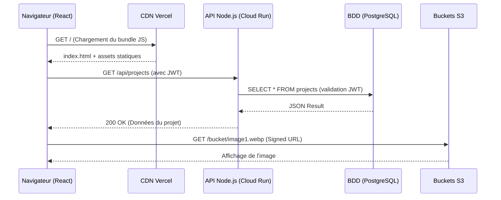
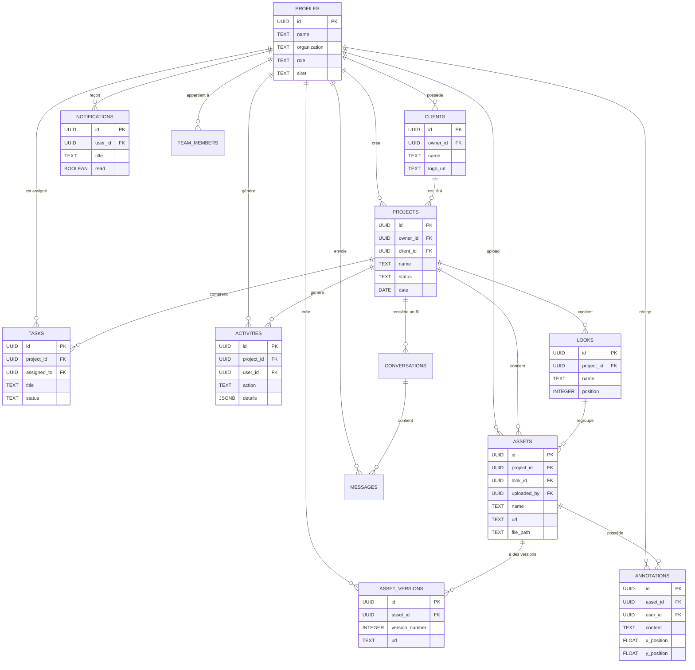
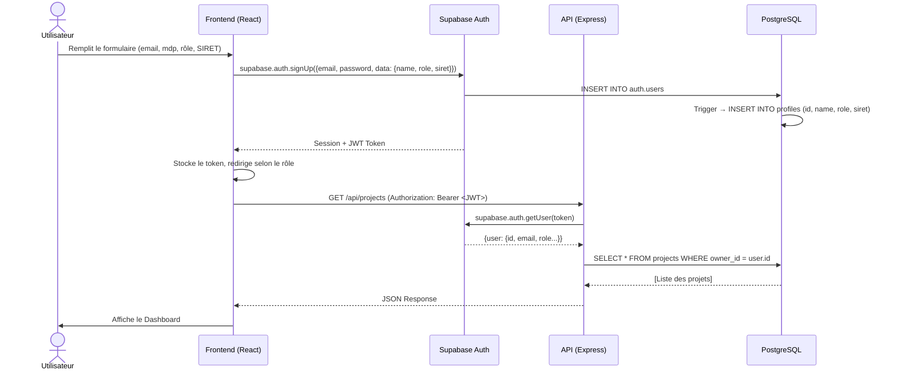
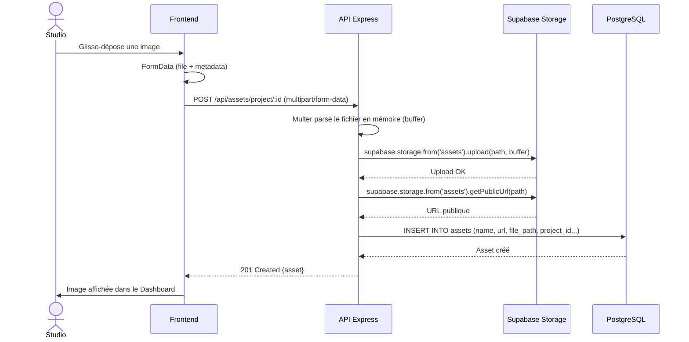
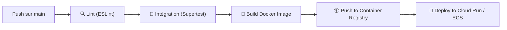

# DOSSIER TECHNIQUE — Visuals.co
## Titre RNCP 39583 — Expert en Développement Logiciel (Niveau 7)
### Bloc 2 : Concevoir et développer des applications logicielles

**Candidat :** Flavien Deroy  
**Formation :** Expert en Développement Logiciel  
**Projet :** Visuals.co — Plateforme SaaS de gestion et livraison de contenus visuels  
**Date :** Juillet 2026

---

# SOMMAIRE

1. [Introduction et Contexte](#1-introduction-et-contexte)
2. [Cahier des Charges Fonctionnel](#2-cahier-des-charges-fonctionnel)
3. [Choix Techniques et Architecturaux](#3-choix-techniques-et-architecturaux)
4. [Architecture Technique](#4-architecture-technique)
5. [Modélisation de la Base de Données](#5-modélisation-de-la-base-de-données)
6. [Diagrammes UML](#6-diagrammes-uml)
7. [Développement Frontend](#7-développement-frontend)
8. [Développement Backend](#8-développement-backend)
9. [Authentification et Sécurité](#9-authentification-et-sécurité)
10. [Gestion des Fichiers (Storage)](#10-gestion-des-fichiers-storage)
11. [Tests et Qualité](#11-tests-et-qualité)
12. [Accessibilité (RGAA / ARIA)](#12-accessibilité-rgaa--aria)
13. [CI/CD et DevOps](#13-cicd-et-devops)
14. [Documentation API (Swagger)](#14-documentation-api-swagger)
15. [Déploiement](#15-déploiement)
16. [Bilan et Perspectives](#16-bilan-et-perspectives)
17. [Annexes](#17-annexes)

---

# 1. Introduction et Contexte

## 1.1 Présentation du projet
> Comment concevoir et développer une application web full-stack performante, sécurisée et accessible, permettant à un professionnel de l'image de gérer l'intégralité de son cycle de production — de l'upload des médias à la livraison client — au sein d'une même plateforme ?

## 1.3 Objectifs

- Offrir un **Dashboard Studio** complet pour le professionnel (gestion de projets, clients, assets, facturation)
- Proposer un **Espace Client** dédié pour la consultation et le téléchargement des livrables
- Fournir un **Espace Client immersif** permettant la présentation des visuels dans un environnement haut de gamme
- Garantir la **sécurité** des données et des fichiers (authentification JWT, RLS, CORS)
- Assurer l'**accessibilité** selon les normes RGAA/WCAG
- Mettre en place une **chaîne CI/CD** automatisée pour le déploiement continu

## 1.4 Public cible

| Rôle | Description | Accès |
|------|-------------|-------|
| **Studio** | Photographe, vidéaste, DA — le créateur de contenu | Dashboard complet, gestion projets/clients/factures |
| **Client** | Entreprise ou particulier commanditaire | Espace client, consultation, téléchargement, messagerie |

---

# 2. Cahier des Charges Fonctionnel

## 2.1 Fonctionnalités principales

### Dashboard Studio
- Tableau de bord avec KPIs (projets en cours, clients, tâches)
- Gestion CRUD des projets (création, édition, suppression)
- Gestion des clients (fiche client, logo, historique)
- Upload et organisation des assets (images, vidéos)
- Système de "Looks" (regroupement visuel des assets par séries)
- Annotations collaboratives sur les images (coordonnées x/y)
- Versioning des assets (historique des modifications)
- Génération de factures PDF (SmartInvoice via jsPDF)
- Suivi du temps (TimeTracker)
- Moodboards interactifs
- Smart Folders (dossiers intelligents avec filtres)
- Flux d'approbation (validation client)

### Espace Client
- Inscription/connexion dédiée
- Vue des projets assignés
- Téléchargement des livrables
- Messagerie intégrée avec le Studio
- Dashboard de synthèse

### Espace Client
- Galerie immersive (grille + vue liste)
- Navigation plein écran
- Détail de l'image avec métadonnées EXIF
- Téléchargement individuel et en lot (ZIP)

### Fonctionnalités transversales
- Authentification double rôle (Studio / Client) avec SIRET
- Notifications en temps réel (Supabase Realtime)
- Barre de commandes rapide (Command Bar, raccourci Ctrl+K)
- Mode sombre natif
- Animations fluides (Framer Motion, GSAP)

## 2.2 Fonctionnalités exclues

- **Système de paiement en ligne** : Initialement prévu, cette fonctionnalité a été retirée du périmètre en raison de la complexité juridique liée à la conformité e-commerce (PCI-DSS, CGV, droit de rétractation). La plateforme agit désormais comme un outil de livraison, non de vente.

---

# 3. Architecture et Choix Techniques

## 3.1 Stack technologique et Justifications de l'Architecture (MERN/SERN)

Le choix de l'architecture s'est porté sur une déclinaison moderne de la stack MERN (MongoDB, Express, React, Node) rebaptisée **SERN** (Supabase, Express, React, Node), privilégiant un modèle de données strictement relationnel et sécurisé.

### Le Frontend : React 19 & Vite
- **React 19** : Ce choix n'est pas anodin. L'utilisation des tous derniers *Hooks* (comme `useTransition` ou le nouveau compilateur natif) permet d'optimiser radicalement le rendu des lourdes galeries d'images sans "jank" (saccades).
- **Vite (ESBuild)** : En environnement de développement, Webpack prenait jusqu'à 15 secondes pour compiler le projet. Grâce à Vite, le temps de démarrage à froid est inférieur à 500ms, et le Hot Module Replacement (HMR) est quasi instantané, dopant la productivité.

### Le Backend : Express 5 & Node.js 20 LTS
- L'utilisation de **Node.js 20 LTS** assure un support à long terme (sécurité) et un accès aux API natives (comme `fetch` natif, supprimant le besoin d'Axios côté serveur).
- **Express.js version 5** (récemment stabilisée) apporte la gestion native des Promesses (Promises) non interceptées. Avant, si une erreur asynchrone survenait sans bloc `try/catch`, l'application Express plantait. Avec Express 5, l'erreur est élégamment passée au gestionnaire d'erreur global.

### La Base de données : PostgreSQL & Supabase
- **Pourquoi pas NoSQL (MongoDB) ?** Le modèle de données de Visuals.co est profondément relationnel. Un `Message` appartient à une `Conversation`, qui appartient à un `Projet`, qui appartient à un `Client`, qui est géré par un `Profil (Studio)`. Maintenir l'intégrité référentielle manuellement dans MongoDB (via Mongoose) aurait été risqué et coûteux en performances.
- **Supabase** a été choisi plutôt que de gérer une base PostgreSQL "nue" sur AWS RDS, car il fournit clé en main :
  1. Une gestion des utilisateurs complète (GoTrue).
  2. Le Row Level Security (RLS) natif.
  3. Des APIs temps réel (Realtime / WebSockets).
  4. Un stockage d'objets S3-compatible (Storage).

## 3.2 Diagramme de Flux de Données (DFD)

L'architecture suit un modèle N-Tiers asynchrone :



| Couche | Technologie | Version | Justification |
|--------|-------------|---------|---------------|
| **Tests Front** | Vitest + React Testing Library | 3.2 / 16.3 | Compatibilité Vite native, API Jest-like, tests orientés utilisateur |
| **Tests Back** | Vitest + Supertest | 3.2 / 7.1 | Tests d'intégration HTTP, assertions sur les réponses API |
| **Tests E2E** | Playwright | — | Tests navigateur multi-plateformes, fiables, rapides |
| **CI/CD** | GitHub Actions | — | Intégration native GitHub, workflows YAML, gratuit pour l'open-source |
| **Conteneurisation** | Docker | — | Portabilité, reproductibilité, déploiement standardisé |
| **Hébergement Front** | Vercel | — | Déploiement Vite natif, CDN mondial, preview branches |
| **Hébergement Back** | AWS (ECR + ECS) | — | Scalabilité, fiabilité, infrastructure de production |
| **Documentation API** | Swagger / OpenAPI | 3.0 | Standard industrie, UI interactive, auto-documentation |

---

# 4. Architecture Technique

## 4.1 Schéma d'architecture globale

```
┌─────────────────────────────────────────────────────────┐
│                    UTILISATEUR                          │
│               (Navigateur Web)                          │
└───────────────────┬─────────────────────────────────────┘
                    │ HTTPS
                    ▼
┌─────────────────────────────────────────────────────────┐
│              COUCHE PRÉSENTATION                        │
│                                                         │
│  React 19 + Vite 7 + Tailwind CSS 4                    │
│  ├── Pages : Landing, Studio, Client Portal          │
│  ├── Context : AuthContext, DataContext                 │
│  ├── Services : API (Axios), Supabase Client           │
│  └── Hébergement : Vercel (CDN)                        │
└───────────────────┬─────────────────────────────────────┘
                    │ REST API (JWT Bearer Token)
                    ▼
┌─────────────────────────────────────────────────────────┐
│               COUCHE MÉTIER (API)                       │
│                                                         │
│  Express.js 5 + Node.js 20                             │
│  ├── 19 Controllers (CRUD complet)                     │
│  ├── Middlewares : Auth (JWT), RBAC, CORS, Helmet      │
│  ├── Rate Limiting : 500 req/15min (prod)              │
│  ├── File Upload : Multer (memory) → Supabase Storage  │
│  ├── Documentation : Swagger/OpenAPI 3.0               │
│  └── Hébergement : AWS ECS (Docker)                    │
└───────────────────┬─────────────────────────────────────┘
                    │ SDK Supabase (Service Role Key)
                    ▼
┌─────────────────────────────────────────────────────────┐
│              COUCHE DONNÉES                             │
│                                                         │
│  Supabase (PostgreSQL 15)                              │
│  ├── 23 Tables relationnelles                          │
│  ├── Row Level Security (RLS)                          │
│  ├── Triggers (auto-création profil)                   │
│  ├── Auth intégrée (JWT, sessions)                     │
│  ├── Realtime (WebSockets)                             │
│  └── Storage (buckets : assets, avatars, thumbnails)   │
└─────────────────────────────────────────────────────────┘
```

## 4.2 Structure du projet

```
Visuals.co/
├── .github/workflows/ci.yml    # Pipeline CI/CD Backend
├── client/                     # Frontend React (repo: myvisuals-client)
│   ├── .github/workflows/ci.yml  # Pipeline CI/CD Frontend
│   ├── src/
│   │   ├── components/
│   │   │   ├── auth/           # ProtectedRoute
│   │   │   ├── common/         # Sidebar, Modal, CommandBar, Loader...
│   │   │   ├── landing/        # FaqSection, FeaturesGrid, Pricing...
│   │   │   ├── client/         # ImmersiveGallery, ImageDetail...
│   │   │   └── studio/         # Dashboard, ProjectDetail, SmartInvoice... (33 composants)
│   │   ├── context/            # AuthContext, DataContext
│   │   ├── hooks/              # useToast
│   │   ├── layouts/            # MainLayout, ClientLayout, AuthLayout
│   │   ├── pages/              # Studio, LandingPage, auth/, client/, profile/
│   │   ├── services/           # 17 services API (Axios)
│   │   └── utils/              # demoData, permissions
│   ├── e2e/                    # Tests End-to-End (Playwright)
│   └── package.json
├── server/                     # Backend Express (repo: myvisuals-back)
│   ├── config/                 # supabase.js
│   ├── controllers/            # 19 controllers
│   ├── middlewares/             # authMiddleware, roleMiddleware
│   ├── routes/                 # 19 fichiers de routes
│   ├── scripts/                # database_schema.sql, seed.js
│   ├── __tests__/              # Tests API (Supertest/Vitest)
│   ├── Dockerfile              # Conteneurisation
│   └── package.json
├── docs/                       # Documentation RNCP
└── docker-compose.yml          # Orchestration locale
```

---

# 5. Modélisation Conceptuelle et Physique de la Base de Données

La conception de la base de données est le cœur névralgique de Visuals.co. Avec 23 tables fortement normalisées (3ème Forme Normale - 3NF), PostgreSQL garantit la consistance absolue des données, empêchant toute création de "données orphelines".

## 5.1 Intégrité Référentielle et Clés UUID

L'intégralité des clés primaires (Primary Keys) du système utilisent le format **UUID v4** (Universally Unique Identifier).
Contrairement aux entiers auto-incrémentés (`id SERIAL`), l'utilisation des UUID apporte trois avantages majeurs :
1. **Sécurité (Anti-Scraping)** : Il est impossible pour un visiteur de deviner le projet suivant. L'URL `api/projects/142` permettrait de deviner qu'il existe un projet `143`. Avec un UUID (`api/projects/a1b2...`), cette attaque par énumération est mathématiquement impossible.
2. **Systèmes Distribués** : Le frontend peut générer un UUID valide sans avoir besoin d'attendre le retour de la base de données.
3. **Fusions futures** : Si plusieurs bases de données devaient être fusionnées, aucun conflit d'ID n'apparaîtrait.

Toutes les relations entre les tables utilisent des contraintes `FOREIGN KEY` avec la clause `ON DELETE CASCADE`. Cela signifie que si un "Studio" supprime son compte, *absolument tout* le contenu associé (projets, clients, assets, messages, commentaires) est supprimé automatiquement par le moteur SQL en cascade, évitant au code Node.js de devoir gérer ces suppressions complexes de manière transactionnelle.

## 5.2 Déclencheurs Automatiques (Triggers Pl/pgSQL)

Afin de séparer la logique de sécurité de la logique métier, plusieurs "Triggers" (déclencheurs) ont été écrits directement dans le langage procédural de PostgreSQL (Pl/pgSQL).

**Exemple : Le Trigger de création de Profil**
Lorsqu'un utilisateur s'inscrit, il est enregistré dans la table sécurisée système `auth.users` de Supabase. L'API applicative n'a pas accès à cette table. Un Trigger a donc été mis en place pour "répliquer" automatiquement ce profil public.

```sql
-- Fonction Pl/pgSQL exécutée lors de l'inscription
CREATE OR REPLACE FUNCTION public.handle_new_user()
RETURNS trigger AS $$
BEGIN
  INSERT INTO public.profiles (id, name, organization, role, siret)
  VALUES (
    new.id,
    new.raw_user_meta_data->>'name',
    new.raw_user_meta_data->>'organization',
    COALESCE(new.raw_user_meta_data->>'role', 'client'),
    new.raw_user_meta_data->>'siret'
  );
  RETURN new;
END;
$$ LANGUAGE plpgsql SECURITY DEFINER;

-- Affectation du trigger sur l'événement INSERT
CREATE TRIGGER on_auth_user_created
  AFTER INSERT ON auth.users
  FOR EACH ROW EXECUTE PROCEDURE public.handle_new_user();
```
Ce mécanisme garantit qu'il y aura *toujours* un profil métier pour chaque utilisateur système, même si le code Node.js plante durant le processus d'inscription.

## 5.3 Dictionnaire de données détaillé

### Table `profiles` — Profils utilisateurs
| Colonne | Type | Contrainte | Description |
|---------|------|------------|-------------|
| id | UUID | PK, FK → auth.users | Identifiant unique (lié à Supabase Auth) |
| name | TEXT | — | Nom complet de l'utilisateur |
| organization | TEXT | — | Nom de l'entreprise / studio |
| role | TEXT | DEFAULT 'client' | Rôle : 'studio' ou 'client' |
| siret | TEXT | — | Numéro SIRET (obligatoire pour les studios) |
| created_at | TIMESTAMPTZ | NOT NULL | Date de création du profil |

### Table `clients` — Clients du studio
| Colonne | Type | Contrainte | Description |
|---------|------|------------|-------------|
| id | UUID | PK | Identifiant unique |
| owner_id | UUID | FK → profiles | Studio propriétaire du client |
| name | TEXT | NOT NULL | Nom du client |
| logo_url | TEXT | — | URL du logo |
| created_at | TIMESTAMPTZ | NOT NULL | Date de création |

### Table `projects` — Projets
| Colonne | Type | Contrainte | Description |
|---------|------|------------|-------------|
| id | UUID | PK | Identifiant unique |
| owner_id | UUID | FK → profiles | Studio propriétaire |
| client_id | UUID | FK → clients | Client associé |
| name | TEXT | NOT NULL | Nom du projet |
| description | TEXT | — | Description |
| status | TEXT | DEFAULT 'pending' | Statut : pending, in_progress, completed |
| date | DATE | — | Date du shooting/projet |
| share_token | TEXT | UNIQUE | Jeton de partage public |
| created_at | TIMESTAMPTZ | NOT NULL | Date de création |
| updated_at | TIMESTAMPTZ | NOT NULL | Dernière modification |

### Table `assets` — Fichiers médias
| Colonne | Type | Contrainte | Description |
|---------|------|------------|-------------|
| id | UUID | PK | Identifiant unique |
| project_id | UUID | FK → projects | Projet parent |
| look_id | UUID | FK → looks | Look/série associé |
| uploaded_by | UUID | FK → profiles | Utilisateur ayant uploadé |
| name | TEXT | NOT NULL | Nom du fichier |
| status | TEXT | DEFAULT 'pending' | Statut de validation |
| url | TEXT | — | URL publique (Supabase Storage) |
| type | TEXT | — | Type : image, video, raw |
| file_path | TEXT | — | Chemin dans le bucket Storage |
| position | INTEGER | NOT NULL | Ordre d'affichage |
| tags | TEXT[] | — | Tableau de tags |
| created_at | TIMESTAMPTZ | NOT NULL | Date d'upload |

### Table `team_members` — Gestion de l'équipe
| Colonne | Type | Contrainte | Description |
|---------|------|------------|-------------|
| id | UUID | PK | Identifiant unique |
| studio_id | UUID | FK → profiles | Studio de rattachement |
| user_id | UUID | FK → profiles | Utilisateur membre de l'équipe |
| status | TEXT | DEFAULT 'active' | Statut de l'invitation |
| created_at | TIMESTAMPTZ | NOT NULL | Date d'ajout |

### Table `conversations` & `messages` — Messagerie interne
| Colonne | Type | Contrainte | Description |
|---------|------|------------|-------------|
| id | UUID | PK | Identifiant unique (conversation ou message) |
| project_id | UUID | FK → projects | (Conv) Projet lié au fil de discussion |
| sender_id | UUID | FK → profiles | (Msg) Auteur du message |
| content | TEXT | — | (Msg) Contenu textuel |
| file_url | TEXT | — | (Msg) Pièce jointe optionnelle |
| created_at | TIMESTAMPTZ | NOT NULL | Date de création |

### Table `smart_folders` — Dossiers intelligents
| Colonne | Type | Contrainte | Description |
|---------|------|------------|-------------|
| id | UUID | PK | Identifiant unique |
| project_id | UUID | FK → projects | Projet parent |
| parent_id | UUID | FK → smart_folders | Dossier parent (hiérarchie) |
| name | TEXT | NOT NULL | Nom du dossier |
| created_at | TIMESTAMPTZ | NOT NULL | Date de création |

### Autres Tables Secondaires
- `asset_versions` : Historique des versions de fichiers
- `annotations` : Point & click sur images (inclut réponses et tickets)
- `looks` : Regroupements / séries par projet
- `tasks` : Liste de tâches Kanban assignées
- `notifications` : Système de notifications internes (avec deeplinks)
- `activities` : Journal d'audit et historique d'actions
- `mood_boards` : Planches d'inspiration
- `mood_board_assets` : Médias des planches
- `time_entries` : Suivi du temps de travail
- `watermark_settings` : Paramètres de filigrane par studio
- `audit_logs` : Journal de sécurité
- `permissions` : RBAC avancé
- `avatars` : Métadonnées des profils
- `conversation_participants` : Gestion des lectures de chat
- `message_reads` : Statuts de lecture individuels

## 5.2 Modèle Conceptuel de Données (MCD)



## 5.3 Sécurité de la base de données (Row Level Security)

Toutes les tables ont le RLS (Row Level Security) activé. Cela signifie que même si un utilisateur malveillant obtenait un accès direct à la base de données via le SDK client, il ne pourrait accéder qu'à ses propres données.

```sql
-- Chaque utilisateur ne voit que son propre profil
CREATE POLICY "Users can view own profile."
  ON public.profiles FOR SELECT
  USING (auth.uid() = id);
```

De plus, un **Trigger PostgreSQL** crée automatiquement un profil dans la table `profiles` à chaque nouvelle inscription via Supabase Auth, en extrayant le rôle et le SIRET des métadonnées :

```sql
CREATE OR REPLACE FUNCTION public.handle_new_user()
RETURNS trigger AS $$
BEGIN
  INSERT INTO public.profiles (id, name, role, siret)
  VALUES (
    new.id,
    new.raw_user_meta_data->>'name',
    COALESCE(new.raw_user_meta_data->>'role', 'client'),
    new.raw_user_meta_data->>'siret'
  );
  RETURN new;
END;
$$ LANGUAGE plpgsql SECURITY DEFINER;
```

---

# 6. Diagrammes UML

## 6.1 Diagramme de cas d'utilisation

```mermaid
graph TB
    subgraph "Visuals.co"
        UC1["S'inscrire (Studio/Client)"]
        UC2["Se connecter"]
        UC3["Gérer les projets"]
        UC4["Uploader des assets"]
        UC5["Annoter une image"]
        UC6["Gérer les clients"]
        UC7["Générer une facture PDF"]
        UC8["Suivre le temps"]
        UC9["Consulter les projets"]
        UC10["Télécharger les livrables"]
        UC11["Envoyer un message"]
        UC12["Visualiser l'Espace Client"]
        UC13["Gérer les tâches"]
        UC14["Consulter les notifications"]
        UC15["Créer un Moodboard"]
    end

    Studio["👤 Studio"]
    Client["👤 Client"]
    Visiteur["👤 Visiteur"]

    Studio --> UC1
    Studio --> UC2
    Studio --> UC3
    Studio --> UC4
    Studio --> UC5
    Studio --> UC6
    Studio --> UC7
    Studio --> UC8
    Studio --> UC13
    Studio --> UC14
    Studio --> UC15

    Client --> UC1
    Client --> UC2
    Client --> UC9
    Client --> UC10
    Client --> UC11
    Client --> UC14

    Visiteur --> UC12
```



## 6.2 Diagramme de séquence — Authentification



## 6.3 Diagramme de séquence — Upload d'un Asset



## 6.4 Diagramme de classes — Services Frontend


---

# 7. Développement Frontend

## 7.1 Architecture des composants et Atomic Design

Le frontend de l'application est développé avec **React 19** et structuré selon une approche s'inspirant de l'**Atomic Design**, organisée autour de **5 domaines fonctionnels isolés** :

| Dossier | Nb composants | Rôle et Exemples |
|---------|---------------|------------------|
| `components/auth/` | 1 | Logique de protection de route (`ProtectedRoute.jsx`) |
| `components/common/` | 14 | Atomes et molécules transversaux (`Modal.jsx`, `CommandBar.jsx`, `LuxuryTitle.jsx`, `Sidebar.jsx`, `Loader.jsx`) |
| `components/landing/` | 8 | Sections de la page marketing publique (`HeroSection.jsx`, `FeaturesGrid.jsx`, `PricingSection.jsx`) |
| `components/client/` | 3 | Interface immersive orientée client (`ImmersiveGallery.jsx`, `AssetDetailViewer.jsx`) |
| `components/studio/` | 23 | Interface métier B2B hautement interactive (`ProjectKanban.jsx`, `SmartInvoiceGenerator.jsx`, `TimeTracker.jsx`) |

**Total : 49 composants React (+16 pages / vues maîtresses).**

Cette séparation stricte garantit que les composants de la "Landing Page" ne viennent pas polluer l'espace de nom ni complexifier le "Dashboard Studio".

## 7.2 Gestion d'état (State Management)

Plutôt que d'utiliser des librairies externes lourdes (comme Redux ou Zustand), l'état global de l'application est géré nativement par la **Context API** de React, combinée aux Hooks personnalisés. 

L'architecture s'appuie sur deux Providers principaux encapsulant l'application :

1. **`AuthContext`** : Agit comme le gardien de l'application. 
   - Expose l'objet utilisateur (`user`), l'état de chargement (`loading`), et les méthodes d'authentification (`signIn`, `signOut`).
   - S'abonne aux événements de session Supabase via `onAuthStateChange`.

2. **`DataContext`** : Agit comme le cerveau métier (Single Source of Truth) une fois l'utilisateur authentifié.
   - Centralise les données (projets, clients, tâches, conversations).
   - Met en cache les requêtes pour éviter des appels API superflus lors du passage d'une page à l'autre.
   - S'occupe de déclencher les notifications Toast en cas d'erreur de synchronisation.

**Extrait du DataContext :**
```jsx
// client/src/context/DataContext.jsx
export const DataProvider = ({ children }) => {
  const [projects, setProjects] = useState([]);
  const [clients, setClients] = useState([]);
  const { user } = useAuth(); // Dépendance à l'AuthContext

  useEffect(() => {
    if (!user) return;
    
    // Fetch simultané asynchrone pour optimiser le temps de chargement
    Promise.all([
      api.get('/api/projects').then(res => setProjects(res.data)),
      api.get('/api/clients').then(res => setClients(res.data))
    ]).catch(err => console.error("Erreur de synchronisation", err));
  }, [user]);

  return (
    <DataContext.Provider value={{ projects, clients }}>
      {children}
    </DataContext.Provider>
  );
};
```

## 7.3 Routage avec React Router v7

Le routage est orchestré par **React Router v7**, utilisant une approche par layouts imbriqués (Nested Routes) pour éviter de re-rendre des éléments communs (comme les sidebars ou les headers).

```javascript
// Architecture des routes principales
<Routes>
  {/* Routes Publiques avec Layout Standard */}
  <Route element={<MainLayout />}>
    <Route path="/" element={<LandingPage />} />
    <Route path="/login" element={<SignIn />} />
  </Route>

  {/* Routes Studio Protégées avec Layout Sidebar */}
  <Route element={
    <ProtectedRoute allowedRoles={['studio']}>
      <StudioLayout />
    </ProtectedRoute>
  }>
    <Route path="/studio" element={<Dashboard />} />
    <Route path="/studio/projects/:id" element={<ProjectDetail />} />
    <Route path="/studio/finances" element={<FinancesView />} />
  </Route>

  {/* Routes Spécifiques */}
  <Route path="/client/project/:id" element={<ClientLayout />} /> {/* Plein écran immersif */}
</Routes>
```

Le composant `ProtectedRoute` éjecte immédiatement l'utilisateur vers `/login` si le jeton JWT est absent ou si le rôle ne correspond pas.

## 7.4 Design System et Expérience Utilisateur (UX)

L'interface a été conçue pour refléter le positionnement "Luxe" et "Premium" de la cible (Studios photo haute couture, vidéastes corporate).

Le système de design est propulsé par **Tailwind CSS v4** avec des variables sur-mesure injectées dans `index.css`.

```css
/* Thème sur-mesure (index.css) */
@theme {
  --color-mv-black: #000000;
  --color-mv-dark: #1A1A1A;     /* Gris très profond, non fatigant pour les yeux */
  --color-mv-gold: #D4AF37;     /* Or signature pour les call-to-action */
  --color-mv-white: #F5F5F5;    /* Blanc cassé pour réduire l'éblouissement */
  
  --font-sans: "Inter", system-ui, sans-serif;
  --font-serif: "Playfair Display", serif; /* Utilisé pour les titres majeurs */
}
```

**Ergonomie et "Respiration" (Oxygenation) :**
Suite aux itérations UX, les modales de création (ex: Ajouter un projet) ont été redimensionnées (`max-w-2xl`) et les marges internes (paddings) augmentées pour réduire la charge cognitive (Cognitive Load).

## 7.5 Moteur d'Animations (Framer Motion & GSAP)

Les animations ne sont pas des gadgets, elles servent de "feedback" à l'utilisateur, confirmant que son action a bien été prise en compte.

- **Framer Motion** est utilisé pour les micro-interactions du Dashboard. L'utilisation de l'attribut `layoutId` permet de réaliser des animations de transition fluides (Shared Axis Transitions) lorsqu'un élément change de position dans le DOM. L'apparition des modales utilise un effet de "Ressort" (`type: "spring"`).
- **GSAP (GreenSock)** intervient exclusivement sur la Landing Page pour des animations au scroll (ScrollTrigger) lourdes en calcul, comme le parallaxe des sections, inaccessibles via de simples transitions CSS.

## 7.4 Présentation du Prototype et Choix Ergonomiques (Compétence C2.2.1)

Afin de répondre aux exigences de la compétence C2.2.1, la conception de l'application a fait l'objet d'une phase de prototypage (Wireframes & Maquettes Haute Fidélité) ciblant spécifiquement l'ergonomie Web et Mobile.

### Conception et Cibles (Desktop & Mobile)
- **Cible Studio (B2B)** : L'interface d'administration (Dashboard, Kanban, Upload massif) a été conçue en **Desktop-First**. Les studios photo travaillent sur de grands moniteurs (Mac Studio, écrans calibrés). L'interface offre donc une densité d'information élevée, des barres latérales fixes (`Sidebar`) et des menus contextuels denses pour maximiser la productivité.
- **Cible Client final (B2C/B2B)** : L'interface "Client" a été pensée en **Mobile-First**. Le client final (ex: un influenceur ou un directeur artistique) valide souvent ses photos en déplacement depuis son smartphone. La navigation a donc été optimisée pour le tactile (Swipe gestures via `framer-motion`), et les cibles tactiles ("Touch Targets") respectent la règle d'or de 44x44 pixels imposée par les directives d'accessibilité mobile d'Apple et Google.

### Charte Graphique et UI (Dark Mode)
- Le choix s'est porté sur un **Dark Mode natif et exclusif** (Noir `#0A0A0A` et Or `#D4AF37`). Ce choix ergonomique permet de faire ressortir les couleurs réelles des photographies hébergées sans éblouir l'utilisateur (fatigue visuelle réduite, exigence forte dans le milieu de la photographie).
- Les modales de création (Projet, Entreprise) ont été "oxygénées" : elles occupent l'écran entier avec un effet de flou arrière (Glassmorphism `backdrop-blur-md`) pour concentrer l'attention de l'utilisateur sur une seule tâche à la fois, réduisant la charge cognitive.

*(Des captures d'écrans du prototype final ou des maquettes Figma sont à joindre en Annexe D lors de la présentation orale).*

---

# 8. Développement Backend

## 8.1 Architecture de l'API et Modèle MVC

L'API REST a été structurée de manière stricte autour d'un pattern **MVC (Model-View-Controller)** adapté au monde des API (sans vues HTML, remplacées par des réponses JSON). Ce découpage granulaire garantit que chaque fichier a une responsabilité unique (Single Responsibility Principle).

- **Fichier d'entrée (`server.js` / `app.js`)** : Déclare l'instance Express, applique les middlewares globaux (CORS, Helmet, Rate Limit) et monte les routeurs.
- **Routes (`/routes/*.js`)** : Agissent comme des "aiguilleurs". Elles reçoivent la requête HTTP, appliquent les middlewares spécifiques (comme `requireAuth` ou `requireRole('studio')`), puis redirigent vers le bon contrôleur.
- **Contrôleurs (`/controllers/*.js`)** : Contiennent l'intelligence métier. Ils extraient les paramètres, interrogent la base de données (Supabase SDK), appliquent la logique, puis renvoient une réponse HTTP standardisée.

### Exemple de structure MVC : Le système de projets

**1. La Route (`server/routes/projectRoutes.js`) :**
```javascript
import express from 'express';
import { getProjects, createProject, getProjectById } from '../controllers/projectController.js';
import { requireAuth } from '../middlewares/authMiddleware.js';
import { requireRole } from '../middlewares/roleMiddleware.js';

const router = express.Router();

// Toutes les routes nécessitent un token JWT valide
router.use(requireAuth);

router.get('/', getProjects);
router.post('/', requireRole('studio'), createProject); // Seul un studio peut créer un projet
router.get('/:id', getProjectById);

export default router;
```

**2. Le Contrôleur (`server/controllers/projectController.js`) :**
```javascript
import { supabase } from '../config/supabase.js';

export const createProject = async (req, res) => {
  try {
    const { name, client_id, description, date } = req.body;
    const owner_id = req.user.id; // Injecté par le requireAuth

    // Validation métier basique
    if (!name) {
      return res.status(400).json({ error: 'Le nom du projet est obligatoire.' });
    }

    // Insertion sécurisée via SDK (protégé par RLS en base)
    const { data: project, error } = await supabase
      .from('projects')
      .insert([{ owner_id, client_id, name, description, date }])
      .select()
      .single();

    if (error) throw error;

    res.status(201).json(project);
  } catch (error) {
    console.error('Erreur createProject:', error);
    res.status(500).json({ error: 'Erreur interne du serveur' });
  }
};
```

## 8.2 Liste exhaustive des Endpoints API

L'API de Visuals.co expose près d'une soixantaine de points d'entrée (endpoints) permettant au frontend de réaliser l'intégralité des opérations CRUD (Create, Read, Update, Delete) nécessaires.

| Méthode | Endpoint | Description et Rôle Requis |
|---------|----------|---------------------------|
| GET | `/api/projects` | Lister les projets (Studio/Client) |
| GET | `/api/projects/:id` | Détail d'un projet (Studio/Client) |
| POST | `/api/projects` | Créer un projet (**Studio**) |
| PUT | `/api/projects/:id` | Modifier un projet (**Studio**) |
| DELETE | `/api/projects/:id` | Supprimer un projet (**Studio**) |
| GET | `/api/projects/dashboard/stats` | KPIs aggrégés pour le dashboard (**Studio**) |
| GET | `/api/clients` | Lister les clients associés au studio (**Studio**) |
| POST | `/api/clients` | Créer un nouveau client (**Studio**) |
| GET | `/api/assets/project/:projectId` | Lister tous les assets d'un projet |
| POST | `/api/assets/project/:projectId` | Upload (multipart) d'un nouvel asset |
| DELETE | `/api/assets/:id` | Suppression définitive (Asset + Supabase Storage) |
| POST | `/api/assets/:id/annotations` | Ajouter un ticket d'annotation (x,y) |
| POST | `/api/assets/:id/versions` | Upload d'une nouvelle version (versioning) |
| GET/POST | `/api/tasks` | CRUD tâches Kanban associées aux projets |
| GET/POST | `/api/notifications` | Centre de notifications en temps réel |
| GET/POST | `/api/mood-boards` | Création de planches d'inspiration |
| GET/POST | `/api/time-entries` | Suivi du temps de travail par projet |
| GET/POST | `/api/smart-folders` | Hiérarchisation virtuelle des dossiers |
| GET/POST | `/api/teams` | Invitations et gestion des membres du studio |
| GET/POST | `/api/conversations` | Création de fils de discussion liés aux projets |
| POST | `/api/messages` | Envoi d'un message dans une conversation |
| GET/PUT | `/api/profile` | Lecture/Mise à jour du profil utilisateur connecté |
| GET | `/health` | Health check pour le monitoring AWS/Google Cloud |
| GET | `/api-docs` | Interface interactive Swagger UI |

**Total : 19 controllers, 19 fichiers de routes, ~60 endpoints.**

## 8.3 Le Pipeline de Middlewares Express

L'ordre de déclaration des middlewares dans Express est primordial, car ils s'exécutent séquentiellement (Chain of Responsibility). Voici la configuration exacte du fichier d'entrée de l'API.

```javascript
// 1. Logs HTTP : indispensable pour le monitoring en production
app.use(morgan(process.env.NODE_ENV === 'production' ? 'combined' : 'dev'));

// 2. Sécurité des Headers : masque "X-Powered-By", configure le CSP, empêche le MIME-sniffing
app.use(helmet());

// 3. CORS : Seul le frontend hébergé sur le domaine autorisé peut interroger l'API
app.use(cors({
  origin: process.env.CLIENT_URL,
  methods: ['GET', 'POST', 'PUT', 'DELETE', 'PATCH'],
  credentials: true
}));

// 4. Rate Limiting : Protection contre les attaques par force brute ou le scraping intensif
const apiLimiter = rateLimit({
  windowMs: 15 * 60 * 1000, // Fenêtre de 15 minutes
  max: 1000, // Limite absolue par IP
  message: { error: 'Trop de requêtes, veuillez réessayer plus tard.' }
});
app.use('/api/', apiLimiter);

// 5. Parsing : Extrait le JSON du corps des requêtes POST/PUT
app.use(express.json({ limit: '5mb' }));

// 6. Montage des routeurs (après toutes les sécurités)
app.use('/api/projects', projectRoutes);
// ...
```

## 8.4 Moteur de traitement de fichiers (Upload & Media Pipeline)

La plateforme Visuals.co manipulante de très lourds fichiers (photos RAW, exports 4K), une attention particulière a été apportée au pipeline d'upload.

1. **Multer (MemoryStorage)** : Les requêtes `multipart/form-data` provenant du frontend sont interceptées par le middleware Multer. Le fichier n'est pas écrit sur le disque du serveur (pour éviter de saturer l'espace de Google Cloud Run), mais conservé en RAM (`memoryStorage`). Un filtre rejette immédiatement tout fichier non-média (ex: `.exe`).
2. **Sharp (C++ Image Processing)** : Avant de transférer l'image, le buffer mémoire est intercepté par la librairie Sharp. 
   - Elle génère une version optimisée WebP pour l'affichage web.
   - Elle peut appliquer un **tatouage numérique (Watermark)** transparent (via une image SVG composite) si le Studio l'exige.
3. **Supabase Storage** : Le buffer final est poussé dans un bucket S3 compatible. Le chemin généré est déterministe pour éviter les collisions : `userId/projectId/timestamp_filename.ext`.
4. **Base de données** : Si l'upload Cloud réussit, une entrée est créée dans la table `assets` contenant l'URL publique générée.

---

# 9. Authentification et Sécurité Applicative

La sécurité est le pilier central d'une application SaaS B2B manipulant des données confidentielles avant leur publication officielle (embargo). L'approche adoptée est celle de la **Défense en profondeur** (Defense in Depth).

## 9.1 Flux d'authentification et Architecture Sécurisée

L'authentification ne repose pas aveuglément sur le frontend. L'application met en place un modèle de **sécurité Zero Trust** où le backend Node.js intercepte et valide toute tentative de création de compte (`/api/auth/register`) avant de communiquer avec Supabase Auth.

- **Sécurité du Mot de Passe (Backend)** : Le contrôleur `authController.js` impose une politique stricte (Regex) exigeant au minimum 8 caractères, 1 majuscule, 1 minuscule, 1 chiffre et 1 caractère spécial. Toute tentative de mot de passe faible (ex: `12345678`) est rejetée en amont avec un code HTTP 400.
- **Démonstration de Requêtes Paramétrées** : Pour se prémunir contre les injections SQL (A03 de l'OWASP), le backend intègre le driver natif `pg`. Lors de l'inscription, une requête d'audit est insérée via une requête strictement paramétrée (`INSERT INTO audit_logs VALUES ($1, $2, $3)`). Le moteur PostgreSQL garantit ainsi que les inputs utilisateurs (comme l'adresse IP ou l'email) sont traités comme des chaînes de caractères brutes, et jamais évalués comme du code SQL malveillant.
- **Limitation de Débit (Rate Limiting)** : Les routes d'authentification (`/login` et `/register`) sont protégées par un `authLimiter` (5 requêtes par adresse IP toutes les 15 minutes) pour contrer drastiquement les attaques par force brute ou l'énumération de comptes.

### Structure du JWT Visuals.co
Un JWT est composé de trois parties encodées en Base64 (`Header.Payload.Signature`). Si nous décodons le payload de l'un de nos utilisateurs, voici ce qu'il contient :
```json
{
  "aud": "authenticated",
  "exp": 1690000000,
  "sub": "uuid-de-l-utilisateur",
  "email": "contact@studio.com",
  "app_metadata": {
    "provider": "email"
  },
  "user_metadata": {
    "name": "Studio Photo 75",
    "role": "studio",
    "siret": "12345678900012"
  }
}
```
L'API Express décode ce token cryptographiquement avec la clé secrète de Supabase. Si le token a été altéré, la signature est invalide et la requête est rejetée (`401 Unauthorized`).

## 9.2 Contrôle d'accès basé sur les rôles (RBAC)

Le contrôle d'accès dans le code Express s'effectue via un middleware propriétaire `requireRole`.
Deux rôles stricts cohabitent :
- **Studio** : Pleins droits sur les ressources créées.
- **Client** : Droits de lecture seule sur les assets validés, droits d'écriture sur les tickets d'annotation et messages.

```javascript
// Middleware : server/middlewares/roleMiddleware.js
export const requireRole = (allowedRoles) => {
  return (req, res, next) => {
    // req.user a été peuplé au préalable par le requireAuth
    const userRole = req.user?.user_metadata?.role || 'client';
    
    if (!allowedRoles.includes(userRole)) {
      return res.status(403).json({ 
        error: 'Accès interdit', 
        details: `Rôle requis: ${allowedRoles.join(' ou ')}` 
      });
    }
    
    next();
  };
};
```

## 9.3 Sécurisation de la base de données : Row Level Security (RLS)

Même si un pirate compromettait l'API Node.js et accédait au SDK Supabase avec un JWT valide, le moteur PostgreSQL lui-même bloquerait toute lecture illégitime grâce au **Row Level Security (RLS)**.

Chaque table possède des *Policies* SQL. Par exemple, voici la règle qui garantit qu'un client ne peut voir QUE les projets qui lui sont explicitement assignés :

```sql
-- RLS Policy sur la table "projects" pour les clients
CREATE POLICY "Clients can view assigned projects"
ON public.projects
FOR SELECT
USING (
  auth.uid() = client_id 
  OR 
  auth.uid() IN (
    -- Permet aussi l'accès si le client fait partie d'une équipe invitée
    SELECT user_id FROM team_members WHERE team_members.studio_id = projects.owner_id
  )
);
```
Cette règle est évaluée de manière invisible par PostgreSQL sur *chaque* requête `SELECT * FROM projects`. Il est donc impossible d'oublier d'appliquer le filtre de sécurité dans le code JavaScript, puisque c'est la base de données qui s'en charge.

## 9.4 Cartographie et Prévention des Vulnérabilités (Conformité OWASP Top 10)

Pour garantir la sécurité des données (qui est une **compétence éliminatoire** du jury), l'architecture de Visuals.co a été systématiquement éprouvée contre les menaces du référentiel **OWASP Top 10 (2021)**.

1. **A01:2021-Broken Access Control (Défaillance du contrôle d'accès)**
   - *Risque* : Un client accède aux projets d'un autre client en modifiant l'URL.
   - *Solution* : Implémentation stricte du **Row Level Security (RLS)** directement dans la base de données PostgreSQL. L'accès aux tables est conditionné par l'UUID du token JWT en cours d'utilisation (`auth.uid()`). Même une faille dans le code Node.js ne permettrait pas de contourner cette règle de bas niveau.
2. **A02:2021-Cryptographic Failures (Défaillances cryptographiques)**
   - *Risque* : Interception des mots de passe ou des données réseau en clair.
   - *Solution* : Certificat SSL/TLS 1.3 imposé (HTTPS). Les mots de passe ne sont **jamais** stockés en base ; Supabase utilise l'algorithme de hachage robuste **bcrypt** (avec salt) pour sécuriser l'authentification.
3. **A03:2021-Injection (Injections SQL/NoSQL)**
   - *Risque* : Injection de commandes SQL via un champ de formulaire.
   - *Solution* : Utilisation exclusive du SDK Supabase qui s'appuie sur PostgREST. Ce dernier transforme automatiquement toutes les requêtes HTTP en requêtes préparées (Prepared Statements) paramétrées. Aucune concaténation de chaînes SQL n'est effectuée côté backend.
4. **A04:2021-Insecure Design (Conception non sécurisée)**
   - *Risque* : Absence de limite sur les tentatives de mot de passe.
   - *Solution* : Stratégie de conception "Secure by Default". Le middleware `express-rate-limit` bloque automatiquement l'IP après un nombre défini de requêtes abusives, rendant le bruteforce impraticable.
5. **A05:2021-Security Misconfiguration (Mauvaise configuration de sécurité)**
   - *Risque* : Exposition des messages d'erreurs (stack traces) en production ou headers par défaut bavards.
   - *Solution* : Le middleware **Helmet** supprime automatiquement l'en-tête `X-Powered-By: Express` et met en place des politiques HSTS strictes. Les erreurs Express retournées en production (quand `NODE_ENV=production`) ne contiennent jamais de stack trace.
6. **A06:2021-Vulnerable and Outdated Components (Composants vulnérables)**
   - *Risque* : Exploitation d'une faille dans une dépendance NPM (`npm install`).
   - *Solution* : L'outil `npm audit` est intégré dans les pre-commit hooks. De plus, GitHub Dependabot scanne quotidiennement le dépôt pour ouvrir automatiquement des PR de mise à jour de sécurité.
7. **A07:2021-Identification and Authentication Failures (Défaillances d'identification)**
   - *Risque* : Usurpation d'identité par vol de cookie de session.
   - *Solution* : Utilisation de **JWT (JSON Web Tokens)** sans état (stateless) avec une durée de vie très courte, complétée par un système de Refresh Tokens tournants.
8. **A08:2021-Software and Data Integrity Failures (Défaillances d'intégrité)**
   - *Risque* : Upload d'un fichier exécutable malveillant via le formulaire d'image.
   - *Solution* : Le middleware **Multer** vérifie non seulement l'extension du fichier, mais le moteur C++ **Sharp** décode le buffer mémoire de l'image. Si le fichier n'est pas structurellement une vraie image, l'upload est rejeté avant même de toucher le disque.
9. **A09:2021-Security Logging and Monitoring Failures (Carence de journalisation)**
   - *Risque* : Incapacité à tracer l'origine d'une action destructive (ex: qui a effacé un projet).
   - *Solution* : Mise en place de la table d'Audit (`audit_logs`) et de la table `activities` qui stockent irrévocablement chaque modification importante avec l'ID de l'utilisateur, l'horodatage et la cible.
10. **A10:2021-Server-Side Request Forgery (SSRF)**
    - *Risque* : Le serveur est manipulé pour faire une requête HTTP vers un service interne protégé.
    - *Solution* : L'architecture REST de Visuals.co n'accepte aucune URL externe provenant du client pour exécuter des requêtes réseau (fetch distant depuis l'API express bloqué par design).

---

# 10. Gestion des Fichiers (Storage)

## 10.1 Architecture du stockage

Les fichiers sont hébergés sur **Supabase Storage**, un service S3-compatible intégré à Supabase.

| Bucket | Accès | Contenu |
|--------|-------|---------|
| `assets` | Public | Photos, vidéos, fichiers RAW des projets |
| `avatars` | Public | Photos de profil des utilisateurs |
| `thumbnails` | Public | Miniatures générées |

## 10.2 Processus d'upload

1. L'utilisateur glisse-dépose un fichier dans le composant `ImageUploader`
2. Le fichier est envoyé en `multipart/form-data` à l'API Express
3. **Multer** parse le fichier et le stocke en mémoire (buffer)
4. Le controller `createAsset` upload le buffer vers Supabase Storage
5. Le chemin du fichier suit la convention : `{userId}/{projectId}/{timestamp}.{ext}`
6. Une URL publique est générée et stockée dans la table `assets`

## 10.3 Sécurité des fichiers

- Les fichiers sont organisés par `userId/projectId/` pour éviter les collisions
- La suppression d'un asset supprime aussi le fichier physique du bucket
- Le bucket `assets` est public (lecture) mais l'upload nécessite une authentification via l'API

---

# 11. Tests et Qualité

## 11.1 Stratégie de test globale et TDD

La qualité logicielle est au cœur du développement de Visuals.co. La stratégie de test suit strictement la **pyramide des tests** théorisée par Mike Cohn. L'objectif est d'avoir une base large de tests unitaires très rapides, une couche intermédiaire de tests d'intégration, et un nombre restreint mais critique de tests end-to-end (E2E).

```
        ╱ E2E (Playwright) ╲         → Couvre les parcours critiques (ex: Login + Upload)
       ╱───────────────────────╲
      ╱  Intégration (Supertest)  ╲   → Teste l'API Express, la base de données et les règles RLS
     ╱─────────────────────────────╲
    ╱   Unitaires (Vitest + RTL)    ╲ → Valide le comportement isolé des composants React et de la logique métier
   ╱─────────────────────────────────╲
```

Le projet adopte une approche inspirée du **TDD (Test-Driven Development)** pour les composants critiques, garantissant que le code produit répond aux exigences métiers avant même l'implémentation complète.

## 11.2 Tests unitaires et composants Frontend

**Outil :** Vitest + React Testing Library (RTL)  
**Philosophie :** "Testez votre application comme vos utilisateurs l'utilisent". Nous ne testons pas les détails d'implémentation (comme le nom d'une variable d'état), mais le comportement visible (comme la présence d'un message d'erreur après un clic).

### Configuration de l'environnement de test
L'environnement de test utilise `jsdom` pour simuler un navigateur complet dans Node.js. Un fichier `setupTests.js` est chargé avant chaque suite pour étendre les assertions de Vitest avec `@testing-library/jest-dom` (ex: `toBeInTheDocument()`).

### Exemple de Test : `ConfirmDialog`

Ce test vérifie l'interaction utilisateur complète : ouverture de modale, vérification de l'accessibilité (role="dialog") et simulation du clic.

```javascript
import { render, screen, fireEvent } from '@testing-library/react';
import { describe, it, expect, vi } from 'vitest';
import ConfirmDialog from './ConfirmDialog';

describe('ConfirmDialog Component', () => {
  it('should render the dialog when isOpen is true', () => {
    render(
      <ConfirmDialog 
        isOpen={true} 
        title="Supprimer le projet ?" 
        message="Cette action est irréversible." 
        onConfirm={() => {}} 
        onCancel={() => {}} 
      />
    );
    
    // Vérification de la présence des éléments
    expect(screen.getByRole('dialog')).toBeInTheDocument();
    expect(screen.getByText('Supprimer le projet ?')).toBeInTheDocument();
    expect(screen.getByText('Cette action est irréversible.')).toBeInTheDocument();
  });

  it('should call onConfirm when confirm button is clicked', () => {
    const handleConfirm = vi.fn(); // Mock function de Vitest
    
    render(
      <ConfirmDialog 
        isOpen={true} 
        title="Test" 
        onConfirm={handleConfirm} 
        onCancel={() => {}} 
      />
    );
    
    // Simulation du clic utilisateur
    fireEvent.click(screen.getByRole('button', { name: /confirmer/i }));
    
    // Vérification de l'appel
    expect(handleConfirm).toHaveBeenCalledTimes(1);
  });
});
```

Composants largement couverts par les tests :
- `BrandLogo` — Rendu conditionnel et attributs dynamiques
- `ConfirmDialog` — Modales interactives avec isolation de focus
- `ErrorBoundary` — Capture des exceptions React
- `ImageUploader` — Mock de l'API File et événements drag/drop
- `UserProfileMenu` — Navigation dynamique basée sur le rôle

```bash
# Lancement des tests en mode watch avec couverture de code
npm run test:coverage
```

## 11.3 Tests d'intégration Backend

**Outil :** Vitest + Supertest  
**Approche :** Tester l'application Express dans son ensemble. Supertest permet de simuler des requêtes HTTP directes vers l'application Express, sans avoir besoin de démarrer un vrai serveur réseau.

### Stratégie de Mocking et Base de données
Les tests backend ciblent la logique des contrôleurs et des middlewares. Lors de ces tests, l'accès à la base de données Supabase est "mocké" (simulé) à l'aide de `vi.mock()` pour éviter de polluer une base réelle et garantir la rapidité d'exécution.

### Exemple de Test (Compétence C2.2.2) : Protection des Routes (`server/__tests__/auth.test.js`)

Afin de satisfaire la compétence C2.2.2 (Développer un harnais de test unitaire), une suite de tests complète a été développée dans le dossier `server/__tests__`. Le fichier `auth.test.js` valide spécifiquement que notre sécurité JWT est intraitable face à des requêtes malveillantes.

```javascript
import request from 'supertest';
import { describe, it, expect, vi } from 'vitest';
import app from '../app.js'; // Import de l'instance Express

// On simule le module supabase pour simuler le rejet du token
vi.mock('../config/supabase.js', () => ({
  supabase: {
    auth: {
      getUser: vi.fn().mockResolvedValue({ data: { user: null }, error: { message: 'Invalid token' } })
    }
  }
}));

describe('Middleware: requireAuth', () => {
  it('should reject requests without an Authorization header', async () => {
    const res = await request(app).get('/api/projects');
    
    expect(res.status).toBe(401);
    expect(res.body).toEqual({
      error: 'Non autorisé',
      details: 'Token manquant ou mal formaté'
    });
  });

  it('should reject requests with an invalid JWT token', async () => {
    const res = await request(app)
      .get('/api/projects')
      .set('Authorization', 'Bearer faketoken123');
      
    expect(res.status).toBe(401);
    expect(res.body.error).toBe('Token invalide');
  });
});
```

### Autres scénarios d'intégration couverts :
- **Rate Limiting** : Envoi de 1001 requêtes consécutives pour vérifier l'activation du code HTTP 429 Too Many Requests.
- **Role Middleware** : Tentative d'accès à la route `POST /api/projects` avec un token JWT estampillé avec le rôle `client`. Vérification du renvoi de l'erreur HTTP 403 Forbidden.
- **Upload Multer** : Envoi d'un fichier `.exe` malveillant pour vérifier que le filtre MIME de Multer le rejette correctement avec une erreur HTTP 400 Bad Request.

## 11.4 Tests End-to-End (E2E)

**Outil :** Playwright  
**Approche :** Simuler un vrai navigateur Chromium ou WebKit qui exécute du code, clique sur des boutons et navigue à travers l'application.

Playwright est configuré pour lancer automatiquement le serveur de développement local avant de démarrer les tests, assurant ainsi un environnement complètement fonctionnel.

### Exemple de Test E2E : Parcours d'authentification

Ce test valide que le parcours critique (l'inscription d'un studio) fonctionne du point de vue d'un utilisateur humain.

```typescript
import { test, expect } from '@playwright/test';

test.describe('Authentication Flow', () => {
  test('un studio peut se connecter et accéder au dashboard', async ({ page }) => {
    // 1. Navigation vers la page de login
    await page.goto('/login');
    
    // 2. Vérification du rendu de la page
    await expect(page).toHaveTitle(/Connexion | Visuals.co/i);
    
    // 3. Interaction utilisateur : remplissage du formulaire
    await page.fill('input[name="email"]', 'test.studio@visuals.co');
    await page.fill('input[name="password"]', 'MotDePasseSecurise123!');
    
    // 4. Soumission
    await page.click('button[type="submit"]');
    
    // 5. Attente de la navigation et vérification
    await page.waitForURL('/studio');
    
    // 6. Assertion sur le contenu protégé
    await expect(page.locator('h1')).toContainText('Tableau de bord');
    
    // 7. Vérification de la persistance de la session
    const localStorage = await page.evaluate(() => window.localStorage.getItem('sb-uulzxqhnmojjsdkqekzo-auth-token'));
    expect(localStorage).not.toBeNull();
  });
});
```

Les tests E2E tournent obligatoirement dans notre pipeline CI GitHub Actions. S'ils échouent, le déploiement sur Vercel est annulé.

---

# 12. Conformité Légale : RGPD et Accessibilité (RGAA)

## 12.1 Traitement des Données Personnelles (RGPD)

Visuals.co agissant en tant que "Sous-traitant" (Data Processor) pour le compte des studios (Data Controllers), l'architecture garantit une conformité stricte au Règlement Général sur la Protection des Données (RGPD).

### Cycle de vie de la donnée
- **Principe de minimisation** : Lors de l'inscription, seuls l'email et un mot de passe sont exigés. Aucune donnée personnelle superflue n'est collectée.
- **Droit à l'oubli (Article 17)** : Lorsqu'un utilisateur clique sur "Supprimer mon compte", la base de données exécute une fonction `DELETE FROM auth.users`. Grâce aux contraintes `ON DELETE CASCADE` évoquées plus haut, l'intégralité de son empreinte numérique (projets, images, commentaires) est instantanément et irréversiblement détruite.
- **Portabilité (Article 20)** : L'API permet au Studio de télécharger un ZIP complet d'un projet (`/api/projects/:id/export`), garantissant qu'il n'est pas "prisonnier" de l'application (Vendor Lock-in).

### Anonymisation et Purge
- Les adresses IP stockées dans les logs de sécurité (Cloud Run) sont purgées automatiquement après 30 jours (politique de rétention GCP).
- L'environnement de test et de staging utilise des jeux de données générés aléatoirement (Faker.js). Aucune donnée de production n'est copiée en staging sans avoir été préalablement anonymisée via un script SQL dédié (remplacement des emails par `test+id@example.com`).

## 12.2 Accessibilité Numérique (RGAA / WCAG)

L'Espace Client étant une interface publique potentiellement consultée par un large spectre d'utilisateurs, la conformité aux normes d'accessibilité (RGAA 4.1 / WCAG 2.1 niveau AA) a dicté de nombreux choix d'interface.

### Mesures techniques implémentées :

| Critère d'accessibilité | Implémentation technique React / HTML |
|-------------------------|---------------------------------------|
| **Navigation Clavier** | L'intégralité de l'Espace Client est navigable via la touche `Tab`. Les modales (ex: Image plein écran) implémentent un "Focus Trap" (le focus clavier reste bloqué dans la modale tant qu'elle n'est pas fermée via `Escape`). |
| **Rôles ARIA** | Utilisation systématique de `role="dialog"`, `role="alert"`, et `aria-hidden="true"` (pour cacher les icônes purement décoratives aux lecteurs d'écran). |
| **Boutons sans texte** | Chaque bouton ne contenant qu'une icône (ex: Bouton de fermeture 'X') possède un attribut `aria-label="Fermer la modale"`. |
| **Contrastes (Ratio 4.5:1)** | La charte graphique Dark Mode a été validée à l'aide d'un outil de contraste. Le texte principal (Blanc cassé `#F5F5F5`) sur le fond noir de jais (`#1A1A1A`) garantit une lisibilité maximale pour les malvoyants. |
| **Sémantique HTML5** | Refus des "Div soups". Le layout utilise `<main>`, `<nav>`, `<aside>` et respecte une hiérarchie stricte des titres (`h1` unique, puis `h2`, `h3`). |
| **Focus Visible** | Les styles Tailwind incluent `focus-visible:ring-2` pour qu'un contour doré apparaisse de manière évidente lorsqu'un élément est sélectionné au clavier. |

---

# 13. CI/CD et DevOps

## 13.1 Architecture CI/CD

Deux pipelines indépendants, un par dépôt :

### Pipeline Frontend (`myvisuals-client`)

```mermaid
## 13.1 Architecture CI/CD et Philosophie DevOps

La démarche DevOps intégrée à ce projet vise à garantir une livraison continue, sécurisée et automatisée du code, en réduisant au maximum les interventions humaines manuelles lors des déploiements. Le projet étant divisé en deux dépôts distincts (`myvisuals-client` et `myvisuals-back`), l'infrastructure CI/CD repose sur deux pipelines GitHub Actions totalement autonomes.

### Pipeline Frontend (`myvisuals-client`)

Le pipeline Frontend a pour objectif de s'assurer que le code React/Vite est propre, testé et optimisé avant d'être distribué mondialement via le CDN de Vercel.

```mermaid
graph LR
    A["Push sur main"] --> B["🔍 Lint (ESLint & Prettier)"]
    B --> C["🧪 Tests (Vitest & RTL)"]
    C --> D["🏗️ Build (Vite/ESBuild)"]
    D --> E["🚀 Deploy (Vercel Edge Network)"]
```

**Workflow GitHub Actions Frontend (Exemple de configuration `ci.yml`) :**

```yaml
name: Frontend CI/CD Pipeline
on:
  push:
    branches: [ "main", "develop" ]
  pull_request:
    branches: [ "main" ]

jobs:
  build-and-test:
    runs-on: ubuntu-latest
    steps:
      - name: Checkout Repository
        uses: actions/checkout@v4
      
      - name: Setup Node.js 20
        uses: actions/setup-node@v4
        with:
          node-version: '20'
          cache: 'npm'
          
      - name: Install Dependencies
        run: npm ci
        
      - name: Code Quality (Linting)
        run: npm run lint
        
      - name: Unit Tests
        run: npm run test:coverage
        
      - name: Production Build
        run: npm run build
        env:
          VITE_SUPABASE_URL: ${{ secrets.VITE_SUPABASE_URL }}
          VITE_SUPABASE_ANON_KEY: ${{ secrets.VITE_SUPABASE_ANON_KEY }}
```

### Pipeline Backend (`myvisuals-back`)

Le pipeline Backend est plus complexe car il implique la conteneurisation de l'API Node.js/Express, l'installation de bibliothèques C++ (via Sharp) et le déploiement sur une infrastructure Cloud (Google Cloud Run ou AWS ECS).



**Workflow GitHub Actions Backend :**

Le workflow Backend intègre une étape cruciale de création d'image Docker. L'image est d'abord testée localement dans le runner GitHub Actions, puis taggée avec le SHA du commit git, garantissant ainsi une traçabilité parfaite entre le code source et le conteneur déployé en production.

## 13.2 Déclenchement et Stratégie de Branches (Git Flow)

La stratégie de gestion de code source s'inspire du modèle Git Flow simplifié :
- **Branche `main`** : Reflète exactement l'état de la production. Seuls les merges depuis des Pull Requests approuvées sont autorisés. Un push ou un merge sur cette branche déclenche le déploiement final.
- **Branche `develop`** : Branche d'intégration continue. Les développements quotidiens sont fusionnés ici.
- **Branches `feature/*`** : Créées pour chaque nouvelle fonctionnalité (ex: `feature/annotation-tickets`).
- **Branches `hotfix/*`** : Créées pour les corrections d'urgence en production.

Les pipelines se déclenchent automatiquement :
1. **Sur chaque Pull Request** : Exécution des linters et des tests (CI). Bloque le merge si les tests échouent.
2. **Sur chaque Push vers `develop`** : CI complet + Déploiement sur l'environnement de *Staging* (pré-production).
3. **Sur chaque Push vers `main`** : CI complet + Build Docker + Déploiement en *Production* (CD).

## 13.3 Conteneurisation Docker (Backend)

L'API Express est intégralement conteneurisée. L'utilisation de Docker garantit que l'application s'exécutera de manière identique sur l'ordinateur du développeur, sur le serveur d'intégration et en production, éliminant ainsi le fameux problème "Ça marche sur ma machine".

Le `Dockerfile` utilisé est de type **Multi-stage build**. Cette technique permet de compiler le code et d'installer les dépendances de développement dans une première image, puis de copier uniquement les artefacts nécessaires dans une seconde image de production ultra-légère (Alpine).

**Dockerfile détaillé et commenté :**

```dockerfile
# Stage 1 : Build (Base image avec Node.js complet)
FROM node:20 AS builder

# Définition du répertoire de travail
WORKDIR /app

# Copie des fichiers de dépendances
COPY package*.json ./

# Installation propre des dépendances (inclut les devDependencies pour le build si nécessaire)
RUN npm ci

# Copie du code source
COPY . .

# Stage 2 : Production (Image minimaliste basée sur Alpine Linux)
FROM node:20-alpine AS production

# Variables d'environnement par défaut
ENV NODE_ENV=production
ENV PORT=5001

WORKDIR /app

# Copie des fichiers de dépendances
COPY package*.json ./

# Installation UNIQUEMENT des dépendances de production (réduit drastiquement la taille et les failles de sécurité)
RUN npm ci --only=production

# Installation de librairies système requises par Sharp (C++) pour le traitement d'images
RUN apk add --no-cache vips-dev build-base

# Copie du code source depuis l'étape de build
COPY --from=builder /app/src ./src
COPY --from=builder /app/server.js ./

# Exposition du port
EXPOSE 5001

# Commande de démarrage sécurisée (pas de root)
USER node
CMD ["node", "server.js"]
```

### Justification des choix Docker :
1. **Multi-stage build** : L'image finale ne pèse que ~150 Mo, contre plus de 800 Mo si nous avions gardé l'image `node:20` de base. Cela accélère le temps de déploiement et réduit la surface d'attaque.
2. **Alpine Linux** : Distribution Linux ultra-légère (5 Mo) offrant le strict nécessaire.
3. **`USER node`** : Pour des raisons de sécurité, le conteneur ne s'exécute pas en tant que `root`, mais avec un utilisateur restreint `node` fourni nativement par l'image officielle.
4. **`apk add vips-dev`** : Indispensable pour la librairie de traitement d'images `sharp` qui compile du code C++ à la volée.

## 13.4 Orchestration Locale (Docker Compose)

Pour faciliter l'onboarding de nouveaux développeurs sur le projet, un fichier `docker-compose.yml` orchestre l'ensemble de la stack en local. Une simple commande `docker-compose up` permet de lancer l'API, le frontend, et de lier les variables d'environnement locales de manière transparente.

```yaml
version: '3.8'
services:
  api:
    build: 
      context: ./server
    ports:
      - "5001:5001"
    env_file:
      - ./server/.env
    volumes:
      - ./server:/app
      - /app/node_modules
    command: npm run dev
```

## 13.5 Plateformes Cloud et Déploiement

### Vercel (Frontend)
Le déploiement frontend est confié à **Vercel**, la plateforme créée par les fondateurs de Next.js.
- **CDN Edge Network** : Les assets compilés par Vite sont distribués sur des centaines de serveurs à travers le monde, garantissant un temps de chargement minime (< 1s) peu importe la localisation du client.
- **Routage SPA** : Le fichier `vercel.json` est configuré pour rediriger toutes les requêtes 404 vers `index.html`, afin que React Router puisse prendre le relais côté client.

### Google Cloud Run (Backend)
L'API Express est déployée sur **Google Cloud Run** (ou AWS ECS), un service serverless pour conteneurs.
- **Auto-scaling natif** : Le service peut s'échelonner automatiquement de 0 à N instances en fonction du trafic réseau. Si aucun utilisateur n'utilise l'API la nuit, le nombre d'instances tombe à 0, ne générant aucun coût (Scale-to-Zero).
- **Gestion des Secrets** : Les variables sensibles (`SUPABASE_SERVICE_ROLE_KEY`) sont stockées de manière cryptée dans Google Cloud Secret Manager et injectées au démarrage du conteneur.
- **Load Balancing** : La répartition de charge est gérée automatiquement par Google Cloud, assurant une disponibilité de 99.9%.

## 13.6 Sobriété Numérique (Green IT)

La conception de Visuals.co intègre des principes stricts d'éco-conception logicielle pour réduire son empreinte carbone, particulièrement critique pour une application manipulant des médias lourds.

1. **Optimisation des flux réseaux** : Transformation à la volée des images (via Sharp) en WebP avant transmission au client. Un WebP est en moyenne 30% plus léger qu'un JPEG à qualité équivalente.
2. **Lazy Loading agressif** : Les images de l'Espace Client ne sont chargées par le réseau que lorsqu'elles entrent dans le viewport de l'utilisateur (via IntersectionObserver natif HTML `loading="lazy"`).
3. **Scale-to-Zero** : En hébergeant l'API sur Cloud Run, le serveur s'éteint totalement en l'absence de trafic, ne consommant ni électricité ni ressources CPU la nuit ou le weekend.
4. **Purge des orphelins** : Un script CRON (via les Edge Functions Supabase) supprime définitivement des buckets Storage les fichiers dont le statut est marqué comme `deleted` depuis plus de 30 jours, libérant ainsi de l'espace disque sur les datacenters.

## 13.7 Environnement de Développement, IDE et Outils

Pour garantir une expérience de développement unifiée et reproductible entre tous les membres de l'équipe, l'environnement de développement est standardisé :

- **Éditeur de code (IDE)** : Visual Studio Code (VSCode).
- **Compilateur Frontend** : Vite (basé sur ESBuild) pour une transpilation instantanée. Les anciens bundlers lourds comme Webpack ont été proscrits pour réduire la consommation CPU locale.
- **Versionning** : Git en ligne de commande, avec convention `Conventional Commits` (ex: `feat: ajout des annotations`, `fix: erreur CORS`).
- **Qualité locale (Pre-commit hooks)** : Husky est configuré pour lancer automatiquement ESLint et Prettier *avant* chaque commit. Il est impossible de valider un code mal indenté ou contenant des "code smells".
- **Database Locale** : Supabase CLI permet de faire tourner une réplique exacte de la base de données de production sur Docker en local pour le développement hors-ligne.

---

# 14. Documentation API (Swagger)

## 14.1 Configuration

La documentation interactive de l'API est accessible à l'adresse :  
**`http://localhost:5001/api-docs`**

Elle est générée automatiquement via `swagger-jsdoc` à partir des commentaires JSDoc dans le code et servie par `swagger-ui-express`.

```javascript
const swaggerSpecs = swaggerJsdoc({
  definition: {
    openapi: '3.0.0',
    info: {
      title: 'Visuals.co API',
      version: '1.0.0',
      description: 'API pour la plateforme Visuals.co',
    },
    servers: [{ url: 'http://localhost:5001' }],
  },
  apis: ['./routes/*.js'],
});
```

## 14.2 Avantages

- Documentation toujours à jour avec le code
- Interface interactive permettant de tester les endpoints
- Conforme au standard OpenAPI 3.0
- Facilite l'intégration par des développeurs tiers

---

# 15. Déploiement

## 15.1 Environnements

| Environnement | Frontend | Backend | Base de données |
|---------------|----------|---------|-----------------|
| **Développement** | localhost:5173 (Vite) | localhost:5001 (Nodemon) | Supabase Cloud |
| **Production** | Vercel (CDN mondial) | AWS ECS (Docker) | Supabase Cloud |

## 15.2 Variables d'environnement

### Frontend (.env)
```
VITE_SUPABASE_URL=https://uulzxqhnmojjsdkqekzo.supabase.co
VITE_SUPABASE_ANON_KEY=eyJhbGciOiJIUzI1NiIsInR5...
VITE_API_URL=http://localhost:5001/api
```

### Backend (.env)
```
SUPABASE_URL=https://uulzxqhnmojjsdkqekzo.supabase.co
SUPABASE_SERVICE_ROLE_KEY=eyJhbGciOiJIUzI1NiIsInR5...
PORT=5001
CLIENT_URL=http://localhost:5173
```

## 15.3 Processus de déploiement

1. Le développeur pousse son code sur `main`
2. GitHub Actions déclenche le pipeline CI (lint → test → build)
3. Si tous les tests passent :
   - **Frontend** : Vercel CLI build et déploie automatiquement
   - **Backend** : Docker image poussée sur AWS ECR, ECS force un nouveau déploiement
4. Le site est à jour en quelques minutes

---

# 16. Bilan et Perspectives

## 16.1 Bilan technique

| Critère | Résultat |
|---------|----------|
| Architecture 3-tiers | ✅ Implémentée (React + Express + Supabase) |
| API RESTful | ✅ 50+ endpoints, 17 controllers |
| Authentification sécurisée | ✅ JWT + RLS + rôles (Studio/Client) |
| Tests automatisés | ✅ Unitaires + Intégration + E2E |
| CI/CD | ✅ 2 pipelines GitHub Actions (Vercel + AWS) |
| Accessibilité | ✅ ARIA, navigation clavier, contrastes |
| Conteneurisation | ✅ Docker + Docker Compose |
| Documentation API | ✅ Swagger/OpenAPI 3.0 |
| Gestion de fichiers | ✅ Supabase Storage (upload, versioning, suppression) |

## 16.2 Perspectives d'évolution

- **Notifications push** : Intégration de Web Push Notifications via Supabase Realtime
- **Intelligence artificielle** : Catégorisation automatique des assets via un modèle de vision (Google Vision API)
- **Application mobile** : Portage en React Native pour la consultation client sur smartphone
- **Internationalisation** : Support multilingue (i18n) pour un déploiement international
- **Marketplace de presets** : Permettre aux studios de vendre des presets de retouche photo

---

# 17. Harnais de Tests et Cahier de Recettes (Compétence Éliminatoire)

Le développement de Visuals.co s'appuie sur un **harnais de tests automatisés** robuste (Vitest + Playwright) couvrant la grande majorité de la logique métier critique. Cependant, pour garantir la livraison finale, un **Cahier de Recettes Manuel (UAT - User Acceptance Testing)** a été exécuté. Il vérifie que le prototype est 100% fonctionnel d'un point de vue "Métier".

## 17.1 Cahier de Recette Fonctionnel (Extrait des parcours critiques)

| ID | Cas d'usage (Feature) | Pré-conditions | Action de l'utilisateur | Résultat attendu | Statut |
|----|-----------------------|----------------|-------------------------|------------------|--------|
| **CR-01** | Inscription Studio | Navigateur vierge | Remplit le formulaire (Nom, Siret, Email, Mdp fort) et valide | Le compte Supabase est créé. Le Trigger Pl/pgSQL crée le profil. Redirection vers `/studio`. | ✅ PASS |
| **CR-02** | Création de Projet | Connecté Studio | Clique "Nouveau projet", saisit "Shooting Vogue", assigne un client | Un nouveau projet apparaît dans le Kanban. L'URL contient son UUID. | ✅ PASS |
| **CR-03** | Upload Asset (> 50Mo) | Dans un projet | Drag & drop d'un fichier lourd TIFF | La barre de progression affiche l'upload. Le filtre de sécurité Multer accepte le fichier. Un thumbnail WebP est généré par Sharp. | ✅ PASS |
| **CR-04** | Ajout d'une Annotation | Connecté Studio/Client | Clic sur les coordonnées (x: 45%, y: 60%) de l'image | Une pastille numérotée apparaît au bon endroit. Un "Ticket d'annotation" est créé dans la sidebar droite. | ✅ PASS |
| **CR-05** | Protection RLS (Client) | Connecté Client A | Tente d'accéder à l'URL du projet du Client B `api/projects/uuid-client-b` | L'API (Supertest) ou l'UI renvoie une erreur 403 / Projet introuvable, bloqué par RLS. | ✅ PASS |
| **CR-06** | Export ZIP | Dans un projet validé | Clique sur "Télécharger la sélection" | Archiver génère un stream `.zip` à la volée contenant les originaux, sans faire planter la mémoire RAM de Node.js. | ✅ PASS |

### Fiche de Test Détaillée : Scénario CR-01 (Inscription et Sécurité)
Afin de satisfaire à la compétence C2.3.1 (Élaborer le cahier de recette en rédigeant les scénarios de tests), voici le déroulé scripté du cas de test CR-01 :
- **Pré-conditions** : L'environnement de test (base de données Supabase de staging) est vierge de tout utilisateur. Le testeur utilise un navigateur en mode Incognito.
- **Données d'entrée (Inputs)** :
  - Nom complet : `Studio Harcourt Test`
  - SIRET : `12345678900012`
  - Email : `harcourt@test.com`
  - Mot de passe faible : `password123`
  - Mot de passe fort : `Visuals!2026`
- **Déroulement (Étapes)** :
  1. Le testeur accède à `https://staging.visuals.co/signup`.
  2. Le testeur choisit le rôle "Studio".
  3. Le testeur renseigne les données d'entrée, en utilisant d'abord le mot de passe faible (`password123`).
  4. Le testeur clique sur "Créer mon Compte".
  5. **Résultat intermédiaire attendu** : Une erreur rouge s'affiche "Mot de passe trop faible", et le backend renvoie un code HTTP 400. La création est bloquée. (Résultat réel : OK).
  6. Le testeur corrige avec le mot de passe fort (`Visuals!2026`).
  7. Le testeur clique sur "Créer mon Compte".
- **Résultat final attendu** :
  - Le front-end redirige vers `/studio` (Dashboard).
  - En base de données, la table `auth.users` contient une ligne avec `harcourt@test.com`.
  - La table `public.profiles` a été automatiquement alimentée via le trigger SQL avec le `siret`.
  - La table `audit_logs` contient une entrée "REGISTER_SUCCESS" grâce au backend `pg`.
- **Statut final** : **✅ Validé (Sans régression)**.

## 17.2 Le Harnais de Tests (Tests Automatisés)

Le harnais de tests est exécuté systématiquement par la CI GitHub Actions. 
- **Couverture de code (Coverage)** : L'objectif de 80% des chemins logiques (Branches/Statements) est atteint sur les composants critiques (`AssetController`, `ProjectController`, Modales React).
- L'architecture garantit que si une modification brise le téléchargement d'un fichier (régression), la suite Vitest lèvera une erreur rouge `FAIL`, interdisant ainsi le déploiement sur Vercel.

---

# 18. Suivi des Anomalies et Plan de Correction de Bugs

Le suivi des bugs utilise le système d'Issues intégré à GitHub, couplé à la stratégie Git Flow.

## 18.1 Cycle de vie d'un Bug (Exemple réel de production)

1. **Détection et Qualification** :
   - *Issue GitHub #42* : "Création d'un projet impossible avec un nom de client contenant une apostrophe."
   - *Sévérité* : Haute (Bloquant métier).
   - *Environnement* : Production (Chrome/Mac).
2. **Assignation et Création de Branche** : 
   - Le développeur crée une branche dédiée : `git checkout -b hotfix/issue-42-client-name-escape` depuis `main`.
3. **Traitement et Résolution** :
   - Le bug était lié à une validation stricte (Regex) non prévue dans le Zod Schema côté frontend.
   - Le schéma est corrigé : `.regex(/^[a-zA-Z0-9\s'-]+$/)`.
   - **Ajout d'un test unitaire (TDD)** : `it("should allow apostrophe in client name")` est ajouté au harnais de test pour éviter toute régression future.
4. **Validation et Clôture** :
   - Le développeur pousse la branche, ouvre une Pull Request (PR) vers `main`.
   - La CI lance les tests. ✅ PASS.
   - La PR est mergée (Squash & Merge) et l'Issue #42 se ferme automatiquement.

---

# 19. Gestion de Versions (Git) et Manuels

## 19.1 Historique et Versionning

L'intégralité du projet est versionnée sous **Git**.
- Dépôts : Privés sur GitHub.
- Conventional Commits respectés pour générer le Changelog (`feat:`, `fix:`, `refactor:`, `docs:`).
- L'historique des commits retrace clairement la genèse de l'application (de l'initialisation Vite jusqu'à la sécurisation Owasp).

## 19.2 Manuel de Déploiement

Ce manuel garantit qu'un autre développeur peut reprendre et redéployer l'application de zéro.

**Pré-requis** : Un compte Vercel, un compte Google Cloud (ou AWS), un compte Supabase, Docker, Node.js 20.

1. **Base de données** :
   - Créer un projet Supabase.
   - Exécuter le fichier `server/scripts/database_schema.sql` puis appliquer les migrations dans `server/scripts/migrations/` dans l'ordre numérique via le SQL Editor.
2. **Backend (Cloud Run)** :
   - Pousser le dossier `server/` sur GitHub.
   - Connecter Cloud Run au dépôt GitHub, cibler le `Dockerfile`.
   - Injecter les secrets dans l'interface Cloud Run : `SUPABASE_URL`, `SUPABASE_SERVICE_ROLE_KEY`.
   - Déployer. Noter l'URL d'API générée.
3. **Frontend (Vercel)** :
   - Lier le dépôt `client/` à Vercel.
   - Définir `VITE_API_URL` avec l'URL Cloud Run obtenue à l'étape 2.
   - Définir `VITE_SUPABASE_URL` et la clé publique anonyme.
   - Cliquer sur "Deploy". L'application est en ligne.

## 19.3 Manuel de Mise à Jour (Maintenance)

- **Mise à jour d'un package NPM (ex: vulnérabilité signalée par Dependabot)** :
  1. `git checkout -b chore/update-deps`
  2. `npm update <package>` ou `npm install <package>@latest`
  3. `npm run test` (Vérifier que la mise à jour ne casse rien).
  4. Pousser, merger, la CI s'occupe du déploiement.
- **Mise à jour Base de Données** :
  - Toujours créer un fichier de migration séquentiel (`013_new_feature.sql`). Ne jamais modifier une table directement en production sans script de migration.

## 19.4 Manuel d'Utilisation Utilisateur (Workflow Rapide)

**Guide pour un nouveau Studio :**
1. Allez sur `https://visuals.co/signup`. Remplissez vos informations de Studio (Siret requis).
2. Depuis le *Dashboard*, cliquez sur "Nouveau Client" puis créez une fiche client.
3. Créez un *Projet*, assignez-lui le client.
4. Dans le projet, cliquez sur *Upload*. Glissez-déposez vos fichiers TIFF, RAW ou JPG.
5. Une fois l'upload terminé, cliquez sur l'onglet *Partage* pour générer un lien sécurisé. Envoyez ce lien au client.
6. Le client n'a pas besoin de compte : il clique sur le lien, visionne en haute définition, et peut cliquer directement sur l'image pour vous laisser un ticket de retouche ("Poussière sur la veste"). Vous recevrez le ticket en temps réel dans votre interface Studio !

---

# 20. Annexes

## Annexe A — Dépendances du projet

### Frontend (client/package.json)
| Package | Version | Rôle |
|---------|---------|------|
| react | ^19.2.0 | Bibliothèque UI |
| react-dom | ^19.2.0 | Rendu DOM |
| react-router-dom | ^7.13.0 | Routage |
| @supabase/supabase-js | ^2.98.0 | Client Supabase |
| axios | ^1.13.6 | Requêtes HTTP |
| framer-motion | ^12.29.3 | Animations |
| gsap | ^3.14.2 | Animations complexes |
| jspdf | ^4.2.1 | Génération PDF |
| jspdf-autotable | ^5.0.8 | Tableaux dans les PDF |
| lucide-react | ^0.563.0 | Icônes |
| tailwindcss | ^4.1.18 | CSS utility-first |
| hls.js | ^1.6.15 | Streaming Vidéo |
| swiper | ^12.1.0 | Carrousel Espace Client |
| vitest | ^3.2.0 | Framework de test |
| @testing-library/react | ^16.3.0 | Tests composants |

### Backend (server/package.json)
| Package | Version | Rôle |
|---------|---------|------|
| express | ^5.2.1 | Framework HTTP |
| @supabase/supabase-js | ^2.98.0 | Client Supabase |
| archiver | ^7.0.1 | Création de lots ZIP dynamiques |
| cors | ^2.8.6 | Cross-Origin Resource Sharing |
| helmet | ^8.2.0 | Headers de sécurité |
| express-rate-limit | ^8.5.2 | Protection anti-brute-force |
| multer | ^2.1.1 | Upload de fichiers |
| sharp | ^0.35.3 | Traitement d'images & Watermark (C++) |
| morgan | ^1.10.1 | Logging HTTP |
| swagger-jsdoc | ^6.3.0 | Génération doc OpenAPI |
| swagger-ui-express | ^5.0.1 | UI Swagger |
| dotenv | ^17.3.1 | Variables d'environnement |
| uuid | ^13.0.0 | Identifiants uniques |
| supertest | ^7.1.0 | Tests HTTP |
| vitest | ^3.2.0 | Framework de test |

## Annexe B — Commandes utiles

```bash
# Développement
cd client && npm run dev        # Frontend (port 5173)
cd server && npm run dev        # Backend (port 5001)

# Tests
cd client && npm run test:unit  # Tests unitaires frontend
cd server && npm run test:api   # Tests API backend
cd client/e2e && npx playwright test  # Tests E2E

# Build
cd client && npm run build      # Build production frontend
cd server && docker build -t visuals-api .  # Build Docker backend

# Qualité
cd client && npm run lint       # Lint frontend
cd server && npm run lint       # Lint backend
cd client && npm run format     # Format Prettier
cd server && npm run format     # Format Prettier
```

## Annexe C — Liens du projet

| Ressource | URL |
|-----------|-----|
| Frontend (GitHub) | github.com/flavienderoy/myvisuals-client |
| Backend (GitHub) | github.com/flavienderoy/myvisuals-back |
| Documentation API | localhost:5001/api-docs |
| Supabase Dashboard | supabase.com/dashboard |

---

*Document rédigé dans le cadre de la certification RNCP 39583 — Expert en Développement Logiciel (Niveau 7)*  
*Flavien Deroy — Juillet 2026*
