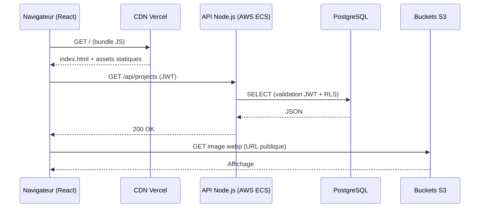
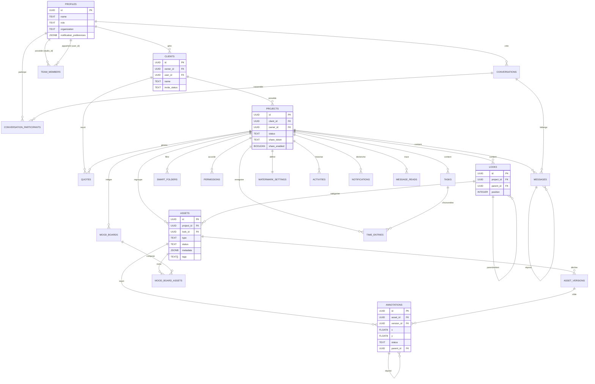
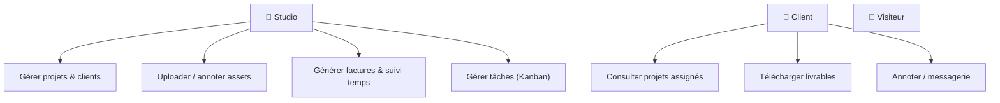
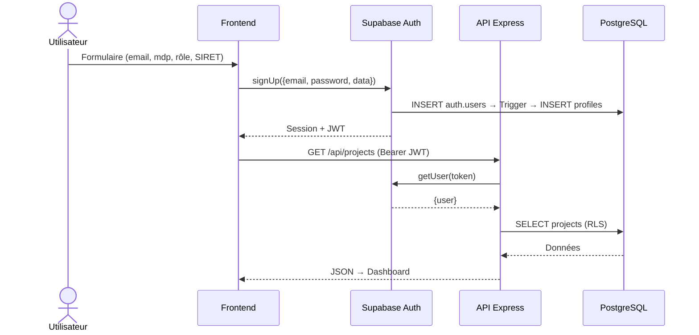
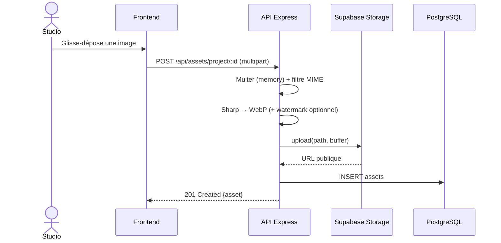
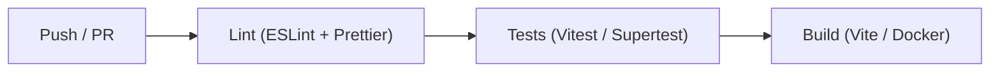
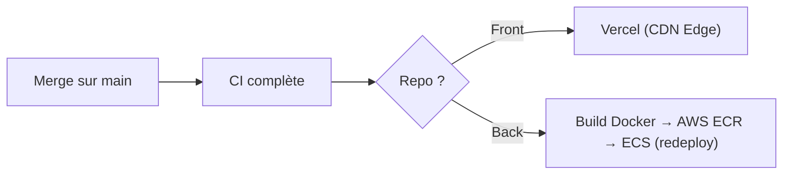

# Dossier Technique — Visuals.co

> **Titre RNCP 39583 — Expert en Développement Logiciel (Niveau 7)**
> **Bloc 2 — Concevoir et développer des applications logicielles**

| | |
|---|---|
| **Candidat** | Flavien Deroy |
| **Projet** | Visuals.co — Plateforme SaaS de gestion et de livraison de contenus visuels |
| **Stack** | React 19 · Express 5 · PostgreSQL / Supabase · Docker · AWS |
| **Dépôts** | `myvisuals-client` (front) · `myvisuals-back` (API) |
| **Date** | Juillet 2026 |

---

## Sommaire

1. [Table de conformité RNCP Bloc 2](#0-table-de-conformité-rncp-bloc-2)
2. [Introduction et contexte](#1-introduction-et-contexte)
3. [Cahier des charges fonctionnel](#2-cahier-des-charges-fonctionnel)
4. [Choix techniques, frameworks et paradigmes](#3-choix-techniques-frameworks-et-paradigmes)
5. [Architecture logicielle et maintenabilité](#4-architecture-logicielle-et-maintenabilité)
6. [Modélisation de la base de données](#5-modélisation-de-la-base-de-données)
7. [Diagrammes UML](#6-diagrammes-uml)
8. [Développement Frontend & Prototype (C2.2.1)](#7-développement-frontend--prototype-c221)
9. [Développement Backend (C2.2.3)](#8-développement-backend-c223)
10. [Sécurité applicative](#9-sécurité-applicative)
11. [Critères de qualité et de performance](#10-critères-de-qualité-et-de-performance)
12. [Stratégie de tests (C2.2.2)](#11-stratégie-de-tests-c222)
13. [Accessibilité & RGPD](#12-accessibilité--rgpd)
14. [CI/CD, conteneurisation & déploiement](#13-cicd-conteneurisation--déploiement)
15. [Cahier de recettes (C2.3.1)](#14-cahier-de-recettes-c231)
16. [Plan de correction des bogues](#15-plan-de-correction-des-bogues)
17. [Historique des versions](#16-historique-des-versions)
18. [Manuels (déploiement, utilisation, mise à jour)](#17-manuels)
19. [Bilan et perspectives](#18-bilan-et-perspectives)
20. [Annexes](#annexes)

---

## 0. Table de conformité RNCP Bloc 2

Le règlement de certification impose **16 éléments** dans le livrable écrit et **4 compétences éliminatoires**. Cette table renvoie chaque exigence à la section qui la traite.

### Éléments du livrable attendu

| # | Élément exigé | Section |
|---|---------------|---------|
| 1 | Protocole de déploiement continu (CD) | [§13.2](#132-déploiement-continu-cd) |
| 2 | Critères de qualité et de performance | [§10](#10-critères-de-qualité-et-de-performance) |
| 3 | Protocole d'intégration continue (CI) | [§13.1](#131-intégration-continue-ci) |
| 4 | Architecture structurée / maintenabilité | [§4](#4-architecture-logicielle-et-maintenabilité) |
| 5 | Présentation d'un prototype | [§7.5](#75-prototype-et-ergonomie-c221) |
| 6 | Frameworks et paradigmes de développement | [§3](#3-choix-techniques-frameworks-et-paradigmes) |
| 7 | Jeu de tests unitaires d'une fonctionnalité | [§11.2](#112-tests-unitaires-frontend) |
| 8 | Mesures de sécurité | [§9](#9-sécurité-applicative) |
| 9 | Accessibilité (situation de handicap) | [§12.1](#121-accessibilité-rgaa--wcag) |
| 10 | Historique des versions | [§16](#16-historique-des-versions) |
| 11 | Dernière version fonctionnelle et viable | [§18](#18-bilan-et-perspectives) |
| 12 | Cahier de recettes | [§14](#14-cahier-de-recettes-c231) |
| 13 | Plan de correction des bogues | [§15](#15-plan-de-correction-des-bogues) |
| 14 | Manuel de déploiement | [§17.1](#171-manuel-de-déploiement) |
| 15 | Manuel d'utilisation | [§17.2](#172-manuel-dutilisation) |
| 16 | Manuel de mise à jour | [§17.3](#173-manuel-de-mise-à-jour) |

### Compétences éliminatoires

| Compétence | Intitulé | Section |
|------------|----------|---------|
| **C2.2.1** | Concevoir un prototype (ergonomie, équipements ciblés, sécurité) | [§7.5](#75-prototype-et-ergonomie-c221) |
| **C2.2.2** | Développer un harnais de test unitaire (prévention des régressions) | [§11](#11-stratégie-de-tests-c222) |
| **C2.2.3** | Développer un logiciel évolutif, sécurisé et accessible | [§8](#8-développement-backend-c223) · [§9](#9-sécurité-applicative) |
| **C2.3.1** | Élaborer le cahier de recette (scénarios et résultats attendus) | [§14](#14-cahier-de-recettes-c231) |

---

## 1. Introduction et contexte

### 1.1 Problématique

> Comment concevoir une application web full-stack performante, sécurisée et accessible, permettant à un professionnel de l'image de gérer l'intégralité de son cycle de production — de l'upload des médias à la livraison client — au sein d'une même plateforme ?

Visuals.co est une plateforme SaaS B2B destinée aux studios photo et vidéo. Elle centralise la gestion de projets, l'organisation des médias, la collaboration avec les clients et la livraison des livrables finaux.

### 1.2 Objectifs

- **Dashboard Studio** complet : projets, clients, assets, facturation, suivi du temps.
- **Espace Client** dédié : consultation, téléchargement des livrables, messagerie.

- **Sécurité** des données et fichiers : JWT, Row Level Security (RLS), CORS, Helmet.
- **Accessibilité** conforme RGAA 4.1 / WCAG 2.1 AA.
- **Chaîne CI/CD** automatisée pour un déploiement continu et fiable.

### 1.3 Public cible

| Rôle | Description | Accès |
|------|-------------|-------|
| **Studio** | Photographe, vidéaste, DA — créateur de contenu | Dashboard complet (projets, clients, factures) |
| **Client** | Entreprise ou particulier commanditaire | Consultation, téléchargement, annotations, messagerie |


---

## 2. Cahier des charges fonctionnel

### 2.1 Fonctionnalités principales

**Dashboard Studio**
KPIs, CRUD projets et clients, upload/organisation des assets, système de « Looks » (séries), annotations collaboratives (coordonnées x/y), versioning des assets, factures PDF (jsPDF), suivi du temps, moodboards, Smart Folders hiérarchiques, flux d'approbation.

> 🖼️ **[CAPTURE À INSÉRER — Fig. 2.1]** — *Dashboard Studio (`/studio`) : vue d'ensemble avec les cartes KPI (projets en cours, clients, tâches) et la liste des projets. Dark Mode, résolution 1440 px, données réalistes (pas de données de démo vides).* → `./screens/01-dashboard-studio.png`

**Espace Client**
Inscription dédiée, vue des projets assignés, téléchargement des livrables, messagerie intégrée, tickets d'annotation.


**Transversal**
Authentification double rôle (Studio / Client) avec SIRET, notifications temps réel (Supabase Realtime), Command Bar (Ctrl+K), Dark Mode natif, animations (Framer Motion, GSAP).

### 2.2 Périmètre exclu

- **Paiement en ligne** : retiré du périmètre en raison de la complexité de conformité e-commerce (PCI-DSS, CGV, droit de rétractation). La plateforme est un outil de **livraison**, non de vente.

---

## 3. Choix techniques, frameworks et paradigmes

### 3.1 Stack technologique (SERN)

L'architecture retenue est une déclinaison moderne de la stack MERN, rebaptisée **SERN** (**S**upabase, **E**xpress, **R**eact, **N**ode), privilégiant un modèle de données strictement relationnel.

| Couche | Technologie | Version | Justification synthétique |
|--------|-------------|---------|---------------------------|
| Frontend | React + Vite | 19 / 7 | Rendu performant des galeries lourdes ; HMR quasi instantané (< 500 ms à froid) |
| Styling | Tailwind CSS | 4 | Design system par variables, cohérence, purge automatique |
| Backend | Express + Node.js | 5 / 20 LTS | Gestion native des promesses rejetées (Express 5), support long terme, `fetch` natif |
| Base de données | PostgreSQL / Supabase | 15 | Modèle relationnel, RLS natif, Auth (GoTrue), Realtime, Storage S3 |
| Tests | Vitest · Supertest · Playwright | — | Compatibilité Vite, tests HTTP d'intégration, E2E multi-navigateurs |
| CI/CD | GitHub Actions | — | Intégration native, workflows YAML |
| Conteneurisation | Docker | — | Reproductibilité, déploiement standardisé |
| Hébergement | Vercel (front) · AWS ECR+ECS (back) | — | CDN mondial ; conteneurs scalables |
| Documentation API | Swagger / OpenAPI | 3.0 | Standard, UI interactive, auto-documentation |

**Pourquoi PostgreSQL plutôt que NoSQL ?** Le modèle de Visuals.co est profondément relationnel (un `Message` appartient à une `Conversation` liée à un `Projet`, lui-même rattaché à un `Client` géré par un `Profil`). Maintenir l'intégrité référentielle dans MongoDB aurait été coûteux et risqué. Supabase fournit clé en main l'Auth, le RLS, le Realtime et le Storage.

### 3.2 Paradigmes de développement

- **Programmation orientée composants** (Frontend) : UI déclarative, composition, réutilisation (Atomic Design, cf. §7.1).
- **Architecture MVC** adaptée aux API REST (Backend) : séparation Routes / Controllers / accès données (cf. §8.1).
- **Programmation asynchrone** : `async/await` et `Promise.all` pour paralléliser les I/O (BDD, Storage).
- **Single Responsibility Principle** : découpage granulaire (1 fichier = 1 responsabilité).
- **Defense in Depth** (sécurité) et **Secure by Default** (cf. §9).
- **Test-Driven Development** sur les composants critiques (cf. §11).

### 3.3 Diagramme de flux de données (DFD)

L'architecture suit un modèle N-Tiers asynchrone.



---

## 4. Architecture logicielle et maintenabilité

### 4.1 Architecture en couches

```
┌───────────────────────────────────────────────┐
│  PRÉSENTATION — React 19 + Vite 7 + Tailwind 4 │
│  Pages · Contexts (Auth, Data) · Services API  │
│  Hébergement : Vercel (CDN)                    │
└───────────────────┬───────────────────────────┘
                    │ REST API (JWT Bearer)
┌───────────────────▼───────────────────────────┐
│  MÉTIER (API) — Express 5 + Node 20            │
│  20 controllers · 3 middlewares (Auth/RBAC/…)  │
│  Helmet · CORS · Rate limiting · Multer+Sharp  │
│  Swagger/OpenAPI · Hébergement : AWS ECS       │
└───────────────────┬───────────────────────────┘
                    │ SDK Supabase (Service Role)
┌───────────────────▼───────────────────────────┐
│  DONNÉES — Supabase (PostgreSQL 15)            │
│  23 tables · RLS · Triggers · Auth · Realtime  │
│  Storage (buckets : assets, avatars, thumbs)   │
└───────────────────────────────────────────────┘
```

### 4.2 Structure du projet

```
Visuals.co/
├── client/                    # Frontend React (repo myvisuals-client)
│   ├── src/
│   │   ├── components/        # 41 composants (6 domaines)
│   │   │   ├── auth/          # ProtectedRoute
│   │   │   ├── common/        # Sidebar, Modal, CommandBar, Loader… (15)
│   │   │   ├── landing/       # HeroSection, FeaturesGrid, Pricing… (8)
│   │   │   ├── client/        # Espace client (1)

│   │   │   └── studio/        # Dashboard, Kanban, SmartInvoice… (13)
│   │   ├── context/           # AuthContext, DataContext
│   │   ├── layouts/           # MainLayout, ClientLayout, AuthLayout
│   │   ├── pages/             # 18 vues
│   │   └── services/          # 19 services API (Axios)
│   └── e2e/                   # Tests E2E (Playwright)
├── server/                    # Backend Express (repo myvisuals-back)
│   ├── controllers/           # 20 controllers
│   ├── middlewares/           # authMiddleware, roleMiddleware, blockClients
│   ├── routes/                # 20 fichiers de routes (~97 endpoints)
│   ├── scripts/               # database_schema.sql + migrations séquentielles
│   ├── __tests__/             # Tests API (Supertest/Vitest)
│   └── Dockerfile
├── docs/                      # Documentation RNCP
└── docker-compose.yml
```

### 4.3 Principes de maintenabilité

- **Séparation stricte des responsabilités** : chaque domaine fonctionnel (auth, studio, client) est isolé côté front ; chaque ressource a son controller/route côté back.
- **Migrations versionnées** : toute évolution de schéma passe par un fichier SQL séquentiel (`001_…` → `012_…`), jamais de modification directe en production.
- **Conventions imposées** : ESLint + Prettier + Husky (pre-commit) garantissent un style homogène.
- **Contrats stables** : l'API REST documentée via Swagger sert de contrat entre front et back.

---

## 5. Modélisation de la base de données

La base compte **23 tables** normalisées (3NF), dont les principales sont formalisées par des migrations séquentielles versionnées (`001_*.sql` → `012_*.sql`).

### 5.1 UUID et intégrité référentielle

Toutes les clés primaires utilisent le format **UUID v4**, apportant trois avantages :

1. **Anti-énumération** : impossible de deviner `api/projects/143` à partir de `142` — l'attaque par énumération est mathématiquement bloquée.
2. **Systèmes distribués** : le frontend peut générer un UUID valide sans aller-retour serveur.
3. **Fusions sans conflit** d'ID.

Toutes les relations utilisent des `FOREIGN KEY … ON DELETE CASCADE` : la suppression d'un compte Studio efface automatiquement l'ensemble de son contenu, sans logique transactionnelle côté Node.

### 5.2 Déclencheurs PL/pgSQL

À l'inscription, l'utilisateur est créé dans la table système `auth.users` (inaccessible à l'API). Un trigger réplique automatiquement un profil métier :

```sql
CREATE OR REPLACE FUNCTION public.handle_new_user()
RETURNS trigger AS $$
BEGIN
  INSERT INTO public.profiles (id, name, organization, role, siret)
  VALUES (
    new.id,
    new.raw_user_meta_data->>'name',
    new.raw_user_meta_data->>'organization',
    COALESCE(new.raw_user_meta_data->>'role', 'client'),
    new.raw_user_meta_data->>'siret'
  );
  RETURN new;
END;
$$ LANGUAGE plpgsql SECURITY DEFINER;

CREATE TRIGGER on_auth_user_created
  AFTER INSERT ON auth.users
  FOR EACH ROW EXECUTE PROCEDURE public.handle_new_user();
```

Ce mécanisme garantit qu'un profil métier existe **toujours**, même si le code Node plante durant l'inscription.

### 5.3 Modèle Conceptuel de Données (MCD complet — 23 tables)



> 🖼️ **[CAPTURE À INSÉRER — Fig. 5.1]** — *Vue « Table Editor » de Supabase montrant la liste des 23 tables (barre latérale) OU le graphe de schéma (Database → Schema Visualizer). Dark Mode, cadrage large.* → `./screens/05-supabase-schema.png`

### 5.4 Dictionnaire de données complet (23 tables)

**Cœur métier**

| Table | Colonnes principales |
|-------|----------------------|
| **`profiles`** | `id` PK (FK `auth.users`), `name`, `email`, `role` (owner/admin/member/client/viewer), `avatar_url`, `organization`, `notification_preferences` JSONB |
| **`clients`** | `id` PK, `name`, `owner_id` FK, `user_id` FK (compte lié), `email`, `logo_url`, `invite_status` (pending/active/declined) |
| **`projects`** | `id` PK, `name`, `client_id` FK, `owner_id` FK, `status` (pending/in_progress/completed/approved/rejected), `date`, `thumbnail_url`, `share_token`, `share_enabled` |
| **`looks`** | `id` PK, `name`, `project_id` FK, `parent_id` FK (arborescence), `position` |
| **`assets`** | `id` PK, `name`, `project_id` FK, `look_id` FK, `type`, `url`, `thumbnail_url`, `file_path`, `preview_path`, `file_size`, `mime_type`, `status`, `metadata` JSONB (EXIF), `tags` TEXT[], `position`, `owner_id` FK |
| **`asset_versions`** | `id` PK, `asset_id` FK, `version_number`, `url`, `thumbnail_url`, `file_path`, `metadata`, `created_by` FK |

**Collaboration & suivi**

| Table | Colonnes principales |
|-------|----------------------|
| **`annotations`** | `id` PK, `asset_id` FK, `version_id` FK, `user_id` FK, `content`, `x`/`y` FLOAT8 (%), `timestamp` (vidéo), `status` (open/resolved), `parent_id` FK (thread), `resolved_at`, `resolved_by` FK |
| **`activities`** | `id` PK, `project_id` FK, `user_id` FK, `type`, `description`, `metadata` JSONB |
| **`tasks`** | `id` PK, `project_id` FK, `title`, `status` (todo/in_progress/review/done), `priority` (low→urgent), `assigned_to` FK, `due_date` |
| **`time_entries`** | `id` PK, `project_id` FK, `user_id` FK, `task_id` FK, `duration` (min), `description`, `date` |
| **`notifications`** | `id` PK, `user_id` FK, `actor_id` FK, `type` (mention/annotation/message/approval), `message`, `project_id` FK, `asset_id` FK, `annotation_id` FK, `read` |

**Organisation & production**

| Table | Colonnes principales |
|-------|----------------------|
| **`mood_boards`** | `id` PK, `project_id` FK, `name`, `description`, `owner_id` FK |
| **`mood_board_assets`** | `mood_board_id` PK/FK, `asset_id` PK/FK, `position` (table de liaison) |
| **`smart_folders`** | `id` PK, `project_id` FK, `name`, `filters` JSONB, `owner_id` FK |
| **`quotes`** | `id` PK, `project_id` FK, `client_id` FK, `status` (draft/sent/accepted/rejected/paid), `total_amount` NUMERIC, `items` JSONB, `valid_until` |
| **`watermark_settings`** | `id` PK, `project_id` FK **UNIQUE**, `text`, `image_url`, `opacity`, `position` |
| **`permissions`** | `id` PK, `project_id` FK, `user_id` FK, `role` (editor/viewer/approver) |

**Messagerie & équipe**

| Table | Colonnes principales |
|-------|----------------------|
| **`conversations`** | `id` PK, `type` (direct/group/project), `title`, `project_id` FK, `created_by` FK |
| **`conversation_participants`** | `id` PK, `conversation_id` FK, `user_id` FK, `role` (admin/member), `last_read_at`, `joined_at` |
| **`messages`** | `id` PK, `conversation_id` FK, `project_id` FK, `sender_id` FK, `content`, `attachments` JSONB, `file_url`, `reactions` JSONB, `reply_to_id` FK |
| **`message_reads`** | `project_id` PK/FK, `user_id` PK/FK, `last_read_at` (accusés de lecture) |
| **`team_members`** | `id` PK, `studio_id` FK, `user_id` FK, `role` (owner/admin/member), `status` (pending/active) |

**Sécurité**

| Table | Colonnes principales |
|-------|----------------------|
| **`audit_logs`** | `id` PK, `action` (REGISTER/LOGIN/FORGOT_PASSWORD…), `resource_type`, `resource_id`, `user_id` FK, `details` JSONB (IP, statut) |

*Toutes les tables portent `created_at` / `updated_at` (TIMESTAMPTZ) et les clés primaires sont en UUID v4.*

### 5.5 Row Level Security (RLS)

Toutes les tables ont le RLS activé : même un accès direct au SDK ne permet de lire que ses propres lignes.

```sql
CREATE POLICY "Clients can view assigned projects"
ON public.projects FOR SELECT
USING (
  auth.uid() = client_id
  OR auth.uid() IN (
    SELECT user_id FROM team_members
    WHERE team_members.studio_id = projects.owner_id
  )
);
```

La règle est évaluée par PostgreSQL sur **chaque** requête : impossible d'oublier le filtre de sécurité côté JavaScript.

> 🖼️ **[CAPTURE À INSÉRER — Fig. 9.1]** — *Onglet « Authentication → Policies » (ou « Database → Policies ») de Supabase, montrant la liste des politiques RLS actives sur les tables (`projects`, `assets`…). Preuve de la sécurité niveau base.* → `./screens/12-supabase-rls.png`

---

## 6. Diagrammes UML

### 6.1 Cas d'utilisation



### 6.2 Séquence — Authentification



### 6.3 Séquence — Upload d'un asset



> 🖼️ **[CAPTURE À INSÉRER — Fig. 6.1]** — *Interface d'annotation : une image ouverte avec une ou plusieurs pastilles numérotées positionnées (x/y) sur le visuel, et le panneau latéral des tickets de retouche (contenu + statut open/resolved).* → `./screens/06-annotation-ticket.png`

---

## 7. Développement Frontend & Prototype (C2.2.1)

### 7.1 Composants — Atomic Design

Le front (React 19) suit une approche **Atomic Design** répartie en **6 domaines isolés**, soit **41 composants** + 18 pages.

| Domaine | Nb | Exemples |
|---------|----|----------|
| `auth/` | 1 | `ProtectedRoute` |
| `common/` | 15 | `Modal`, `CommandBar`, `Sidebar`, `Loader` |
| `landing/` | 8 | `HeroSection`, `FeaturesGrid`, `Pricing` |
| `client/` | 1 | Espace client |

| `studio/` | 13 | `ProjectKanban`, `SmartInvoiceGenerator`, `TimeTracker` |

Cette séparation évite que les composants marketing ne polluent l'espace de nom du Dashboard.

> 🖼️ **[CAPTURE À INSÉRER — Fig. 7.5]** — *SmartInvoice : un devis/facture PDF généré (jsPDF) affiché à l'écran, avec en-tête studio, lignes d'items et total. Illustre la table `quotes` et la génération PDF.* → `./screens/15-smartinvoice-pdf.png`

### 7.2 Gestion d'état

L'état global repose sur la **Context API** native (pas de Redux/Zustand), via deux providers :

- **`AuthContext`** — gardien de l'application : expose `user`, `loading`, `signIn`, `signOut` ; s'abonne à `onAuthStateChange`.
- **`DataContext`** — *Single Source of Truth* métier : centralise et met en cache projets, clients, tâches, conversations.

```jsx
useEffect(() => {
  if (!user) return;
  Promise.all([
    api.get('/api/projects').then(r => setProjects(r.data)),
    api.get('/api/clients').then(r => setClients(r.data)),
  ]).catch(err => console.error("Erreur de synchronisation", err));
}, [user]);
```

### 7.3 Routage (React Router v7)

Routage par **layouts imbriqués** pour éviter de re-rendre les éléments communs. `ProtectedRoute` éjecte vers `/login` si le JWT est absent ou si le rôle ne correspond pas.

```jsx
<Route element={<ProtectedRoute allowedRoles={['studio']}><StudioLayout /></ProtectedRoute>}>
  <Route path="/studio" element={<Dashboard />} />
  <Route path="/studio/projects/:id" element={<ProjectDetail />} />
</Route>
```

### 7.4 Design system

Positionnement « premium » propulsé par **Tailwind CSS v4** avec variables sur-mesure et **Dark Mode natif** (fond noir, or signature `#D4AF37`).

```css
@theme {
  --color-mv-black: #0A0A0A;
  --color-mv-gold:  #D4AF37;   /* CTA signature */
  --color-mv-white: #F5F5F5;   /* blanc cassé, anti-éblouissement */
  --font-serif: "Playfair Display", serif;
}
```

> 🖼️ **[CAPTURE À INSÉRER — Fig. 7.1]** — *Landing page (`/`) : section héro avec le titre en Playfair Display, l'or signature et le Dark Mode. Montre le positionnement « premium ».* → `./screens/07-landing-hero.png`
>
> 🖼️ **[CAPTURE À INSÉRER — Fig. 7.2]** — *Command Bar ouverte (raccourci `Ctrl+K`) par-dessus le Dashboard, listant les actions rapides / la recherche.* → `./screens/08-command-bar.png`

### 7.5 Prototype et ergonomie (C2.2.1)

La conception a fait l'objet d'une phase de prototypage (wireframes + maquettes haute fidélité) ciblant deux ergonomies distinctes :

- **Studio (B2B) — Desktop-First** : les studios travaillent sur grands moniteurs calibrés. L'interface offre une densité d'information élevée, une `Sidebar` fixe et des menus contextuels denses pour maximiser la productivité.
- **Client final — Mobile-First** : le client valide souvent en déplacement. Navigation tactile (swipe via Framer Motion), cibles tactiles respectant la règle des **44 × 44 px** (directives Apple/Google).

**Choix ergonomiques liés à la sécurité et au confort** : Dark Mode exclusif (fait ressortir les couleurs réelles des photos, réduit la fatigue visuelle) ; modales de création « oxygénées » (plein écran + `backdrop-blur`) pour concentrer l'attention sur une tâche unique et réduire la charge cognitive.

> 🖼️ **[CAPTURE À INSÉRER — Fig. 7.3]** — *Prototype Studio Desktop-First : formulaire d'inscription/connexion (`/signup`) montrant le champ SIRET et la sélection du rôle Studio/Client. Illustre C2.2.1 (ergonomie + sécurité).* → `./screens/09-signup-desktop.png`
>
> 🖼️ **[CAPTURE À INSÉRER — Fig. 7.4]** — *Prototype Client Mobile-First : même parcours capturé en viewport mobile (375 px) — vue projet ou validation d'un visuel au doigt. Illustre l'ergonomie tactile (touch targets 44 px).* → `./screens/10-client-mobile.png`

> *Les maquettes Figma haute fidélité sont jointes en Annexe D pour la présentation orale.*

---

## 8. Développement Backend (C2.2.3)

### 8.1 Architecture MVC

L'API REST suit un pattern **MVC** adapté aux API (réponses JSON au lieu de vues HTML) :

- **`app.js`** — instance Express, middlewares globaux, montage des routeurs.
- **Routes** — aiguillage + middlewares spécifiques (`requireAuth`, `requireRole`).
- **Controllers** — logique métier, accès BDD (SDK Supabase), réponse HTTP standardisée.

```javascript
// routes/projectRoutes.js
router.use(requireAuth);
router.get('/', getProjects);
router.post('/', requireRole('studio'), createProject);
router.get('/:id', getProjectById);
```

```javascript
// controllers/projectController.js
export const createProject = async (req, res) => {
  try {
    const { name, client_id, description, date } = req.body;
    const owner_id = req.user.id;                 // injecté par requireAuth
    if (!name) return res.status(400).json({ error: 'Le nom est obligatoire.' });

    const { data: project, error } = await supabase
      .from('projects')
      .insert([{ owner_id, client_id, name, description, date }])
      .select().single();
    if (error) throw error;

    res.status(201).json(project);
  } catch (err) {
    console.error('createProject:', err);
    res.status(500).json({ error: 'Erreur interne du serveur' });
  }
};
```

### 8.2 Endpoints API

L'API expose **~97 endpoints** répartis sur **20 fichiers de routes** couvrant l'intégralité des opérations CRUD.

| Méthode | Endpoint | Rôle requis |
|---------|----------|-------------|
| GET/POST/PUT/DELETE | `/api/projects` | Studio (écriture), Studio+Client (lecture) |
| GET | `/api/projects/dashboard/stats` | Studio |
| GET/POST | `/api/clients` | Studio |
| GET/POST/DELETE | `/api/assets/project/:projectId` | Studio (upload) |
| POST | `/api/assets/:id/annotations` · `/versions` | Studio + Client |
| GET/POST | `/api/tasks`, `/notifications`, `/mood-boards`, `/time-entries`, `/smart-folders`, `/teams`, `/conversations`, `/messages` | selon rôle |
| GET/PUT | `/api/profile` | Utilisateur connecté |
| GET | `/health` · `/api-docs` | Public (monitoring + Swagger) |

> 🖼️ **[CAPTURE À INSÉRER — Fig. 8.1]** — *Interface Swagger UI (`localhost:5001/api-docs`) : liste des endpoints regroupés par tag, avec une route dépliée montrant le schéma de requête/réponse. Preuve de la documentation OpenAPI 3.0.* → `./screens/11-swagger-ui.png`

### 8.3 Pipeline de middlewares

L'ordre de déclaration est primordial (Chain of Responsibility) :

```javascript
app.use(morgan(prod ? 'combined' : 'dev'));      // 1. Logs HTTP
app.use(helmet());                               // 2. Headers de sécurité
app.use(cors({ origin: process.env.CLIENT_URL, credentials: true }));  // 3. CORS
app.use('/api/', apiLimiter);                    // 4. Rate limiting (500/15min)
app.use(express.json({ limit: '5mb' }));         // 5. Parsing JSON
app.use('/api/projects', projectRoutes);         // 6. Routeurs
```

Trois middlewares propriétaires : `requireAuth` (validation JWT), `requireRole` (RBAC), `blockClients` (verrou de routes réservées au Studio).

### 8.4 Pipeline de traitement des fichiers

La plateforme manipule de lourds fichiers (RAW, exports 4K) :

1. **Multer (memoryStorage)** — le fichier reste en RAM (jamais sur disque). Un filtre rejette tout non-média (`.exe`).
2. **Sharp (C++)** — génère une version **WebP** optimisée, applique un **watermark** SVG optionnel.
3. **Supabase Storage** — buffer poussé vers un bucket S3, chemin déterministe `userId/projectId/timestamp_filename.ext`.
4. **BDD** — insertion dans `assets` avec l'URL publique.

---

## 9. Sécurité applicative

Approche **Défense en profondeur** (Defense in Depth), essentielle pour une application manipulant des données sous embargo.

### 9.1 Authentification Zero Trust

Le backend intercepte et valide toute inscription **avant** de communiquer avec Supabase Auth.

- **Politique de mot de passe (Regex)** : ≥ 8 caractères, 1 majuscule, 1 minuscule, 1 chiffre, 1 spécial. Rejet en HTTP 400.
- **Requêtes paramétrées** : le driver `pg` insère les logs d'audit via `INSERT INTO audit_logs VALUES ($1,$2,$3)` — les entrées utilisateur ne sont jamais évaluées comme du SQL (protection injection).
- **Rate limiting renforcé** : `authLimiter` = 5 requêtes / IP / 15 min sur `/login` et `/register` (anti-brute-force).

Le JWT (Header.Payload.Signature, Base64) est décodé cryptographiquement avec la clé secrète Supabase ; toute altération invalide la signature → `401 Unauthorized`.

### 9.2 Contrôle d'accès par rôles (RBAC)

```javascript
export const requireRole = (allowedRoles) => (req, res, next) => {
  const userRole = req.user?.user_metadata?.role || 'client';
  if (!allowedRoles.includes(userRole)) {
    return res.status(403).json({ error: 'Accès interdit' });
  }
  next();
};
```

- **Studio** — pleins droits sur ses ressources.
- **Client** — lecture des assets validés, écriture sur annotations et messages.

### 9.3 Row Level Security

Dernier rempart : même une API compromise ne contourne pas le RLS PostgreSQL (cf. §5.5). Le filtre `auth.uid()` est appliqué au niveau moteur, indépendamment du code applicatif.

### 9.4 Conformité OWASP Top 10 (2021)

| Risque | Mesure mise en œuvre |
|--------|----------------------|
| **A01** Broken Access Control | RLS PostgreSQL conditionné à `auth.uid()` |
| **A02** Cryptographic Failures | TLS 1.3 imposé ; mots de passe hachés bcrypt (salt) par Supabase |
| **A03** Injection | SDK Supabase / PostgREST → requêtes préparées, aucune concaténation SQL |
| **A04** Insecure Design | Secure by Default ; `express-rate-limit` |
| **A05** Security Misconfiguration | Helmet (masque `X-Powered-By`, HSTS) ; pas de stack trace en prod |
| **A06** Vulnerable Components | `npm audit` en pre-commit ; Dependabot quotidien |
| **A07** Auth Failures | JWT stateless courte durée + refresh tokens tournants |
| **A08** Data Integrity Failures | Multer (MIME) + décodage Sharp : rejet des faux fichiers image |
| **A09** Logging Failures | Tables `audit_logs` et `activities` (traçabilité horodatée) |
| **A10** SSRF | Aucune URL externe cliente exécutée côté serveur (bloqué par design) |

---

## 10. Critères de qualité et de performance

### 10.1 Critères de qualité (code & processus)

| Critère | Cible | Outil / mécanisme |
|---------|-------|-------------------|
| Style de code homogène | 0 erreur lint | ESLint + Prettier (bloquant en pre-commit via Husky) |
| Couverture de tests | ≥ 80 % sur les modules critiques | Vitest `--coverage` |
| Non-régression | 100 % des tests verts avant merge | GitHub Actions (bloque la PR sinon) |
| Sécurité des dépendances | 0 vulnérabilité haute | `npm audit` + Dependabot |
| Traçabilité | Convention Conventional Commits | `feat:`, `fix:`, `refactor:` |
| Documentation API | 100 % des routes documentées | Swagger/OpenAPI 3.0 |

### 10.2 Critères de performance

| Critère | Cible | Moyen technique |
|---------|-------|-----------------|
| Démarrage front (dev, à froid) | < 500 ms | Vite / ESBuild |
| Chargement initial (prod) | < 1 s | CDN Vercel + code-splitting |
| Poids des images livrées | −30 % vs JPEG | Conversion WebP à la volée (Sharp) |
| Chargement des galeries | Sans « jank » | Lazy loading (`loading="lazy"` + IntersectionObserver) |
| Latence API (lecture) | Faible et constante | Requêtes ciblées + cache DataContext |
| Disponibilité | 99,9 % | Auto-scaling AWS + Load Balancing |
| Abus / scraping | Bloqué | Rate limiting (500 req/15 min ; 5 req/15 min sur l'auth) |

---

## 11. Stratégie de tests (C2.2.2)

### 11.1 Pyramide des tests

```
        ╱  E2E (Playwright)  ╲        → parcours critiques (login + upload)
       ╱───────────────────────╲
      ╱ Intégration (Supertest)  ╲    → API Express, RLS, middlewares
     ╱─────────────────────────────╲
    ╱  Unitaires (Vitest + RTL)     ╲ → composants React, logique métier
   ╱─────────────────────────────────╲
```

Approche **TDD** sur les composants critiques ; harnais exécuté systématiquement par la CI. **Couverture ≥ 80 %** sur `AssetController`, `ProjectController` et les modales React.

> 🖼️ **[CAPTURE À INSÉRER — Fig. 11.1]** — *Rapport de couverture de tests : sortie de `npm run test:coverage` (tableau Statements/Branches/Functions/Lines dans le terminal) OU le rapport HTML `coverage/index.html`. Preuve du seuil de 80 %.* → `./screens/13-coverage.png`

### 11.2 Tests unitaires (Frontend)

**Vitest + React Testing Library** — philosophie « testez l'application comme l'utilisateur l'utilise » : on teste le comportement visible, pas les détails d'implémentation. Environnement `jsdom`, assertions étendues via `@testing-library/jest-dom`.

```javascript
describe('ConfirmDialog', () => {
  it('affiche le dialogue quand isOpen est true', () => {
    render(<ConfirmDialog isOpen title="Supprimer le projet ?"
             message="Action irréversible." onConfirm={() => {}} onCancel={() => {}} />);
    expect(screen.getByRole('dialog')).toBeInTheDocument();
    expect(screen.getByText('Supprimer le projet ?')).toBeInTheDocument();
  });

  it('appelle onConfirm au clic', () => {
    const handleConfirm = vi.fn();
    render(<ConfirmDialog isOpen title="Test" onConfirm={handleConfirm} onCancel={() => {}} />);
    fireEvent.click(screen.getByRole('button', { name: /confirmer/i }));
    expect(handleConfirm).toHaveBeenCalledTimes(1);
  });
});
```

Composants couverts : `BrandLogo`, `ConfirmDialog`, `ErrorBoundary`, `ImageUploader`, `UserProfileMenu`.

### 11.3 Tests d'intégration (Backend)

**Vitest + Supertest** — requêtes HTTP directes vers l'app Express sans serveur réseau. La BDD est mockée (`vi.mock()`) pour la rapidité et l'isolation.

```javascript
vi.mock('../config/supabase.js', () => ({
  supabase: { auth: { getUser: vi.fn().mockResolvedValue(
    { data: { user: null }, error: { message: 'Invalid token' } }) } }
}));

describe('Middleware: requireAuth', () => {
  it('rejette une requête sans header Authorization', async () => {
    const res = await request(app).get('/api/projects');
    expect(res.status).toBe(401);
    expect(res.body).toEqual({ error: 'Non autorisé', details: 'Token manquant ou mal formaté' });
  });
});
```

Fichiers de test (`server/__tests__/`) : `auth`, `roleMiddleware`, `security`, `routes`, `imageProcessor`, `health`, `404`. Scénarios couverts : rejet JWT invalide, HTTP 403 pour un client tentant `POST /api/projects`, rejet d'un `.exe` par Multer (400), activation du 429 sous rate limiting.

### 11.4 Tests End-to-End

**Playwright** — vrai navigateur Chromium/WebKit ; le serveur dev est lancé automatiquement avant les tests. Un échec E2E **annule le déploiement** Vercel.

```typescript
test('un studio se connecte et accède au dashboard', async ({ page }) => {
  await page.goto('/login');
  await page.fill('input[name="email"]', 'test.studio@visuals.co');
  await page.fill('input[name="password"]', 'MotDePasseSecurise123!');
  await page.click('button[type="submit"]');
  await page.waitForURL('/studio');
  await expect(page.locator('h1')).toContainText('Tableau de bord');
});
```

---

## 12. Accessibilité & RGPD

### 12.1 Accessibilité (RGAA 4.1 / WCAG 2.1 AA)

| Critère | Implémentation |
|---------|----------------|
| Navigation clavier | Tout l'Espace Client navigable au `Tab` ; **Focus Trap** dans les modales (fermeture `Escape`) |
| Rôles ARIA | `role="dialog"`, `role="alert"`, `aria-hidden` sur les icônes décoratives |
| Boutons sans texte | `aria-label` systématique (ex. « Fermer la modale ») |
| Contrastes | Ratio ≥ 4.5:1 validé (blanc cassé `#F5F5F5` sur fond `#0A0A0A`) |
| Sémantique HTML5 | `<main>`, `<nav>`, `<aside>` ; hiérarchie stricte des titres (h1 unique) |
| Focus visible | `focus-visible:ring-2` (contour doré au clavier) |

### 12.2 RGPD

Visuals.co agit comme **sous-traitant** (Data Processor) pour les studios (Data Controllers).

- **Minimisation** : seuls email + mot de passe exigés à l'inscription.
- **Droit à l'oubli (art. 17)** : « Supprimer mon compte » → `DELETE FROM auth.users` ; le `ON DELETE CASCADE` détruit instantanément toute l'empreinte.
- **Portabilité (art. 20)** : export ZIP complet d'un projet (`/api/projects/:id/export`).
- **Rétention** : IP des logs purgées après 30 jours ; staging alimenté par données anonymisées (Faker.js).

---

## 13. CI/CD, conteneurisation & déploiement

Deux pipelines GitHub Actions **autonomes**, un par dépôt.

### 13.1 Intégration continue (CI)

Objectif : garantir un code propre, testé et buildable avant tout merge.



```yaml
# .github/workflows/ci.yml (frontend)
name: Frontend CI/CD
on: { push: { branches: ["main","develop"] }, pull_request: { branches: ["main"] } }
jobs:
  build-and-test:
    runs-on: ubuntu-latest
    steps:
      - uses: actions/checkout@v4
      - uses: actions/setup-node@v4
        with: { node-version: '20', cache: 'npm' }
      - run: npm ci
      - run: npm run lint
      - run: npm run test:coverage
      - run: npm run build
        env:
          VITE_SUPABASE_URL: ${{ secrets.VITE_SUPABASE_URL }}
          VITE_SUPABASE_ANON_KEY: ${{ secrets.VITE_SUPABASE_ANON_KEY }}
```

**Déclenchement** — Git Flow : `feature/*` → PR (CI bloquante) ; `develop` → CI + déploiement staging ; `main` → CI + déploiement production.

> 🖼️ **[CAPTURE À INSÉRER — Fig. 13.1]** — *Onglet « Actions » du dépôt GitHub : un run de pipeline réussi (coches vertes lint → test → build). Preuve de l'intégration continue automatisée.* → `./screens/14-github-actions.png`

### 13.2 Déploiement continu (CD)



- **Frontend → Vercel** : build Vite distribué mondialement (CDN Edge). `vercel.json` redirige les 404 vers `index.html` (routage SPA).
- **Backend → AWS** : image Docker taggée au SHA du commit (traçabilité code ↔ conteneur), poussée sur **ECR**, puis **ECS** force un nouveau déploiement. Secrets injectés via AWS Secrets Manager.

> 🖼️ **[CAPTURE À INSÉRER — Fig. 13.2]** — *Preuve de déploiement : tableau de bord Vercel (déploiement « Ready » avec l'URL de prod) et/ou la console AWS ECS montrant le service en cours d'exécution. Montre la dernière version en ligne.* → `./screens/16-deploiement.png`

### 13.3 Conteneurisation Docker

`Dockerfile` **multi-stage** : build complet puis image de production Alpine ultra-légère (~150 Mo vs ~800 Mo).

```dockerfile
FROM node:20 AS builder
WORKDIR /app
COPY package*.json ./
RUN npm ci
COPY . .

FROM node:20-alpine AS production
ENV NODE_ENV=production PORT=5001
WORKDIR /app
COPY package*.json ./
RUN npm ci --only=production
RUN apk add --no-cache vips-dev build-base   # requis par Sharp (C++)
COPY --from=builder /app ./
EXPOSE 5001
USER node                                     # pas de root
CMD ["node", "server.js"]
```

**Justifications** : multi-stage (surface d'attaque réduite), Alpine (5 Mo), `USER node` (moindre privilège), `vips-dev` (dépendance native de Sharp). Un `docker-compose.yml` orchestre la stack en local (`docker-compose up`).

### 13.4 Sobriété numérique (Green IT)

- **WebP à la volée** (Sharp) : −30 % de poids réseau vs JPEG.
- **Lazy loading agressif** : images chargées à l'entrée dans le viewport.
- **Auto-scaling** : réduction automatique des instances en heures creuses.
- **Purge des orphelins** : CRON (Edge Functions Supabase) supprimant les fichiers `deleted` > 30 jours.

---

## 14. Cahier de recettes (C2.3.1)

Le harnais automatisé (Vitest + Playwright) est complété par un **Cahier de Recettes manuel (UAT)** validant le prototype d'un point de vue métier.

### 14.1 Recette fonctionnelle (parcours critiques)

| ID | Cas d'usage | Action | Résultat attendu | Statut |
|----|-------------|--------|------------------|--------|
| **CR-01** | Inscription Studio | Formulaire (Nom, SIRET, email, mdp fort) | Compte + trigger profil ; redirection `/studio` | ✅ |
| **CR-02** | Création projet | « Nouveau projet » + client assigné | Projet dans le Kanban, URL avec UUID | ✅ |
| **CR-03** | Upload lourd (>50 Mo) | Drag & drop TIFF | Progression, filtre Multer OK, thumbnail WebP (Sharp) | ✅ |
| **CR-04** | Annotation | Clic à (x 45 %, y 60 %) | Pastille numérotée + ticket dans la sidebar | ✅ |
| **CR-05** | Protection RLS | Client A tente le projet du Client B | Erreur 403 / introuvable (bloqué par RLS) | ✅ |
| **CR-06** | Export ZIP | « Télécharger la sélection » | Stream `.zip` à la volée sans saturer la RAM | ✅ |

### 14.2 Scénario détaillé — CR-01 (inscription & sécurité)

- **Pré-conditions** : base staging vierge, navigateur en mode incognito.
- **Données** : Nom `Studio Harcourt Test`, SIRET `12345678900012`, email `harcourt@test.com`, mdp faible `password123`, mdp fort `Visuals!2026`.
- **Déroulement** :
  1. Accès à `staging.visuals.co/signup`, rôle « Studio ».
  2. Saisie avec le **mdp faible** → **résultat attendu** : erreur « Mot de passe trop faible », HTTP 400, création bloquée. ✅
  3. Correction avec le **mdp fort** → soumission.
- **Résultat final** : redirection `/studio` ; ligne dans `auth.users` ; profil alimenté par le trigger avec le SIRET ; entrée `REGISTER_SUCCESS` dans `audit_logs`.
- **Statut** : ✅ **Validé (sans régression)**.

---

## 15. Plan de correction des bogues

Suivi via les **GitHub Issues** couplées au Git Flow.

**Cycle de vie d'un bug (exemple réel — Issue #42)**

1. **Détection** — « Création de projet impossible avec un nom de client contenant une apostrophe ». Sévérité : haute (bloquant). Environnement : production (Chrome/Mac).
2. **Branche dédiée** — `git checkout -b hotfix/issue-42-client-name-escape` depuis `main`.
3. **Résolution** — cause : validation Regex trop stricte côté front (Zod). Correctif : `.regex(/^[a-zA-Z0-9\s'-]+$/)`. **Ajout d'un test TDD** `it("autorise l'apostrophe dans le nom du client")` pour prévenir la régression.
4. **Clôture** — Pull Request → CI verte ✅ → Squash & Merge ; l'Issue #42 se ferme automatiquement.

---

## 16. Historique des versions

Projet versionné sous **Git** (dépôts privés GitHub), commits en **Conventional Commits** générant le changelog.

| Version | Jalon | Contenu principal |
|---------|-------|-------------------|
| v0.1 | Initialisation | Scaffolding Vite + Express, Auth Supabase, schéma initial |
| v0.4 | Cœur métier | CRUD projets/clients/assets, upload Multer + Sharp |
| v0.6 | Collaboration | Annotations (x/y), messagerie, notifications Realtime |
| v0.8 | Sécurité & tests | RLS complet, RBAC, harnais Vitest/Supertest, OWASP |
| v0.9 | Dossiers & équipe | Smart Folders (arbre), team members, forgot/reset password |
| v1.0 | Industrialisation | Docker multi-stage, CI/CD, Swagger, accessibilité, déploiement |

L'historique des commits retrace la genèse de l'application, de l'initialisation à la sécurisation OWASP.

---

## 17. Manuels

### 17.1 Manuel de déploiement

**Pré-requis** : comptes Vercel, AWS, Supabase ; Docker ; Node.js 20.

1. **Base de données** — créer le projet Supabase, exécuter `server/scripts/database_schema.sql`, puis appliquer `server/scripts/migrations/*` dans l'ordre numérique via le SQL Editor.
2. **Backend (AWS)** — pousser `server/` sur GitHub ; construire l'image Docker → ECR ; déployer sur ECS ; injecter `SUPABASE_URL`, `SUPABASE_SERVICE_ROLE_KEY` via Secrets Manager ; noter l'URL d'API.
3. **Frontend (Vercel)** — lier `client/` ; définir `VITE_API_URL` (URL back), `VITE_SUPABASE_URL`, `VITE_SUPABASE_ANON_KEY` ; « Deploy ».

### 17.2 Manuel d'utilisation

**Guide Studio (workflow rapide)**

1. `visuals.co/signup` → renseigner les informations Studio (SIRET requis).
2. Dashboard → « Nouveau Client » → créer une fiche.
3. Créer un **Projet**, y assigner le client.
4. Dans le projet → **Upload** → glisser-déposer TIFF/RAW/JPG.
5. Onglet **Partage** → générer un lien sécurisé, l'envoyer au client.
6. Le client (sans compte) ouvre le lien, visionne en HD et laisse des **tickets de retouche** reçus en temps réel côté Studio.

### 17.3 Manuel de mise à jour

- **Dépendance NPM (alerte Dependabot)** : `git checkout -b chore/update-deps` → `npm update <pkg>` → `npm run test` → push → merge (CI déploie).
- **Base de données** : toujours créer un fichier de migration séquentiel (`013_*.sql`). **Ne jamais** modifier une table en production sans script versionné.

---

## 18. Bilan et perspectives

### 18.1 Bilan technique (dernière version — v1.0, fonctionnelle et viable)

| Critère | Résultat |
|---------|----------|
| Architecture 3-tiers | ✅ React + Express + Supabase |
| API RESTful | ✅ ~97 endpoints, 20 controllers |
| Authentification sécurisée | ✅ JWT + RLS + RBAC |
| Tests automatisés | ✅ Unitaires + Intégration + E2E |
| CI/CD | ✅ 2 pipelines GitHub Actions (Vercel + AWS) |
| Accessibilité | ✅ ARIA, clavier, contrastes AA |
| Conteneurisation | ✅ Docker multi-stage + Compose |
| Documentation API | ✅ Swagger/OpenAPI 3.0 |

### 18.2 Perspectives

Web Push Notifications · catégorisation IA des assets (Vision API) · portage React Native · internationalisation (i18n) · marketplace de presets.

---

## Annexes

### Annexe A — Dépendances principales

**Frontend** : react 19 · react-router-dom 7 · @supabase/supabase-js 2 · axios · framer-motion · gsap · jspdf · tailwindcss 4 · hls.js · swiper · vitest · @testing-library/react.

**Backend** : express 5 · @supabase/supabase-js 2 · archiver · cors · helmet · express-rate-limit · multer · sharp · morgan · swagger-jsdoc · swagger-ui-express · dotenv · uuid · supertest · vitest.

### Annexe B — Commandes utiles

```bash
# Développement
cd client && npm run dev          # Front (5173)
cd server && npm run dev          # API  (5001)

# Tests
cd client && npm run test:unit
cd server && npm run test:api
cd client/e2e && npx playwright test

# Build & qualité
cd client && npm run build
cd server && docker build -t visuals-api .
npm run lint && npm run format
```

### Annexe C — Liens du projet

| Ressource | URL |
|-----------|-----|
| Frontend (GitHub) | github.com/flavienderoy/myvisuals-client |
| Backend (GitHub) | github.com/flavienderoy/myvisuals-back |
| Documentation API | localhost:5001/api-docs |
| Supabase Dashboard | supabase.com/dashboard |

### Annexe D — Maquettes du prototype

*Captures Figma (Studio Desktop-First / Client Mobile-First) jointes lors de la présentation orale.*

---

*Document rédigé dans le cadre de la certification RNCP 39583 — Expert en Développement Logiciel (Niveau 7).*
*Flavien Deroy — Juillet 2026.*
